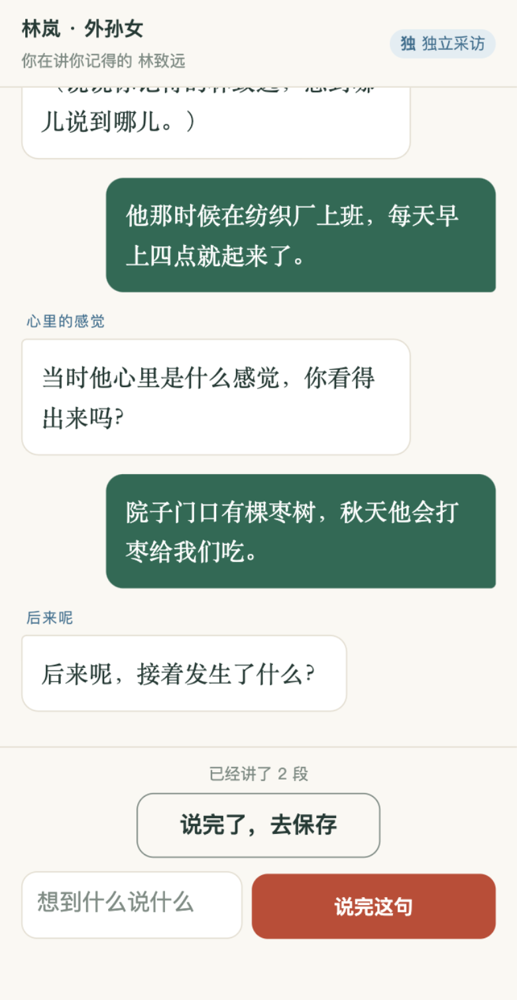

# 拾光家忆

> 写下我走过的一生，也珍藏我们共同经历的家。

`#shenicest-fission` · 软件赛道 · 微信小程序文字 MVP

## 作品简介

拾光家忆是一款面向不同年龄人生主角及其亲人的文字记忆工具。它把两类很容易混淆的内容明确分开：

- **人生之书**讲当前用户自己的故事，只使用本人亲自讲述的经历生成个人章节。
- **记忆之家**讲当前用户和家人的共同故事，以家庭时间线保存愿意彼此看见的记忆。

本次黑客松版本聚焦一条可演示的文字闭环：

1. 用户在人生之书回答一个关于自己的问题，用“我”讲述；
2. 个人片段只进入当前用户的书，并可整理成个人章节；
3. 用户在记忆之家回答一个关于家人的问题，用“我们”讲述；
4. 家庭片段经确认后进入共同时间线，可按家庭成员筛选；
5. 两套片段、草稿和生成来源在领域层隔离，不能互相串入。

未经确认的家庭投稿在确认前只对投稿人和确认者可见。个人故事强制保持本人私有；家庭共同记忆不会被用于生成任何人的人生之书。

## Slogan

**我的一生，我们的家。**

## 黑客松合规声明

- 黑客松于 2026-08-27 开始，本仓库于 2026-08-28 在比赛期间创建。
- 赛前只有家庭人物传记的产品想法和需求讨论，没有“拾光家忆”的可运行代码。
- 本仓库不复制、不包含、也不依赖既有 `Drinking-Time` 项目的代码、Git 历史、数据库或线上服务。
- 比赛结束后可能探索产品整合，但该整合不属于本次提交成果。
- 完整说明见 [HACKATHON_COMPLIANCE.md](HACKATHON_COMPLIANCE.md)。

## 技术栈

- 原生微信小程序
- TypeScript
- 微信云函数（可选 AI 生成通道）
- OpenAI-compatible 文本模型接口
- Node.js 内置测试运行器

## 当前实现边界

本仓库首先交付可在微信开发者工具中运行的单设备演示闭环。真实微信身份、跨设备家庭邀请、云数据库持久化和正式内容审核仍是后续工作，演示时不会把这些能力描述成已经完成。

当云函数尚未配置 AI 密钥时，应用会使用明确标注的“本地演示草稿”模式：它只按当前用户亲自讲述的个人片段整理文字，不冒充 AI 生成，也不会补造事实。

内容边界在当前单设备演示中由领域层统一执行：`personal` 片段只进入作者自己的书和草稿；`family` 片段只在确认且家庭可见后进入记忆之家。旧缓存中没有作用域的片段按家庭记忆处理，避免误入个人书。正式多人版本仍需通过微信身份、云端访问控制和删除撤回来执行同一规则。

首页顶部的身份切换是**本地演示身份**，用于在一台设备上演示家人视角与老人视角，不代表已经打通真实微信身份或跨设备家庭空间。

## 本地运行

1. 安装依赖：`npm install`
2. 类型与测试检查：`npm run check`
3. 在微信开发者工具中导入仓库根目录
4. 当前项目 AppID 为 `wx6be512f0fe129b62`；使用微信开发者工具的成员需先由管理员添加为该小程序的开发者
5. 如需使用虚构资料演示真实 AI 生成，可在微信云开发中部署 `cloudfunctions/generateBiography` 并配置服务端环境变量
6. 部署完成后，将 `miniprogram/config/runtime.ts` 中的 `CLOUD_AI_ENABLED` 改为 `true`；真实用户使用前不得开启，需先补齐服务端身份、来源校验、配额和请求去重

## AI 云函数环境变量

- `AI_API_KEY`：模型服务密钥，只能配置在云函数服务端
- `AI_BASE_URL`：OpenAI-compatible API 根地址
- `AI_MODEL`：文本模型名称

任何密钥都不得写入小程序代码或提交到 GitHub。

## 演示路径

个人路径：`人生之书 → 写我的故事 → 个人采访 → 保存到我的书 → 整理章节 → 查看个人来源`

家庭路径：`记忆之家 → 记共同回忆 → 家庭采访 → 等待确认 → 家庭时间线`

## 界面预览

以下截图均来自微信开发者工具的真实编译结果（iPhone 12/13 Pro 模拟器，基础库 3.17.1）。

| 人生之书首页 | 记忆之家 · 家庭时间线 |
| --- | --- |
|  |  |

| 老人确认 · 一次一条 | 章节阅读 · 来源可展开 |
| --- | --- |
|  |  |

| 回忆采访 · 每轮只追问一个方向 |
| --- |
|  |

## 团队与分工

团队成员和最终分工将在提交前按真实情况补充。开发过程记录见 [DEVELOPMENT_LOG.md](DEVELOPMENT_LOG.md)。

完整项目说明见 [docs/project-document.md](docs/project-document.md)，演示视频脚本见 [docs/demo-script.md](docs/demo-script.md)。

继续开发前先阅读 [人生之书／记忆之家叙事边界交接](docs/handoff/2026-08-28-personal-book-family-home-separation.md) 和 [微信小程序前端重设计交接](docs/handoff/2026-08-28-mini-program-ui-redesign-handoff.md)。队友原型已原样保存在 [docs/references/team-prototypes/](docs/references/team-prototypes/)，实现时继续复用其结构与跳转思路，但不要把 Web/React 方式或静态 HTML 直接搬进原生小程序。

## 提交提醒

GitHub 仓库应设置 topic `shenicest-fission`；报名材料中使用标签 `#shenicest-fission`。最终还需提交赛道及命题、项目图片、项目文档和演示视频。
