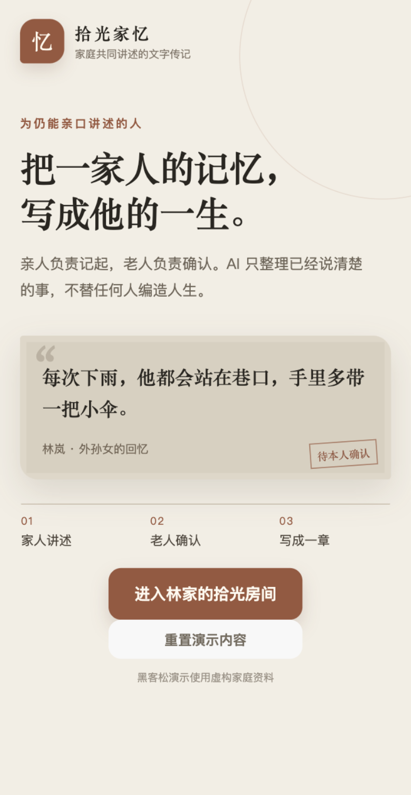
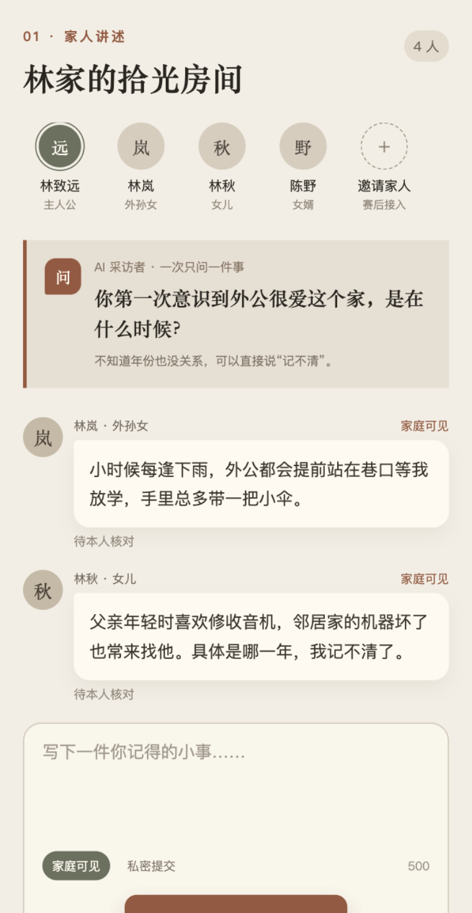
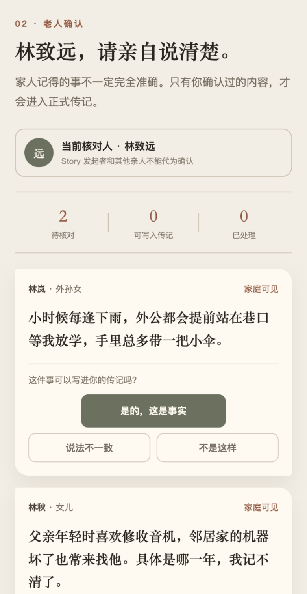
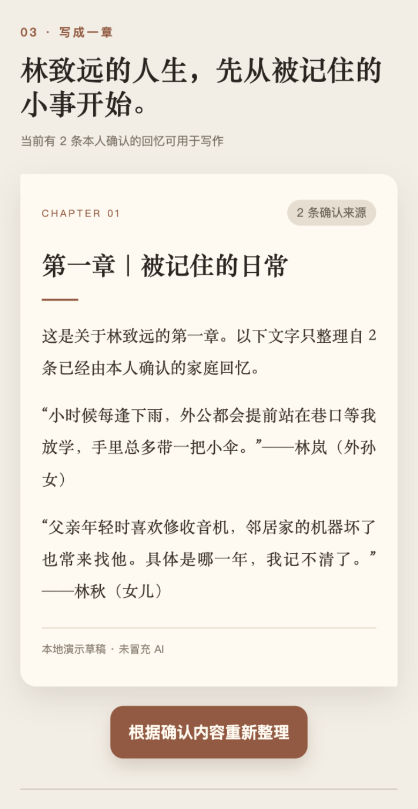

# 拾光家忆

> 一家人共同讲述，由老人亲自确认，把零散回忆写成可信的人物传记。

`#shenicest-fission` · 软件赛道 · 微信小程序文字 MVP

## 作品简介

拾光家忆是一款面向在世老人及其亲人的家庭人物传记工具。亲人像在家庭群里聊天一样补充回忆，老人逐条确认事实，系统只使用已经确认、且投稿者选择家庭可见的材料生成章节式传记。

本次黑客松版本聚焦一条可演示的文字闭环：

1. 家人进入家庭房间并提交一段文字回忆；
2. 老人确认、拒绝或保留冲突；
3. 系统只汇总确认且家庭可见的材料；私密投稿即使属实也不会自动进入传记；
4. 生成并阅读传记第一章。

## Slogan

**把一家人的记忆，写成他的一生。**

## 黑客松合规声明

- 黑客松于 2026-08-27 开始，本仓库于 2026-08-28 在比赛期间创建。
- 赛前只有家庭人物传记的产品想法和需求讨论，没有“拾光家忆”的可运行代码。
- 本仓库不复制、不包含、也不依赖既有 `Drinking-Time` 项目的代码、Git 历史、数据库或线上服务。
- 比赛结束后可能探索产品整合，但该整合不属于本次提交成果。
- 完整说明见 [HACKATHON_COMPLIANCE.md](HACKATHON_COMPLIANCE.md)。

## 技术栈

- 原生微信小程序
- TypeScript
- 微信云函数（可选 AI 生成通道）
- OpenAI-compatible 文本模型接口
- Node.js 内置测试运行器

## 当前实现边界

本仓库首先交付可在微信开发者工具中运行的单设备演示闭环。真实微信身份、跨设备家庭邀请、云数据库持久化和正式内容审核仍是后续工作，演示时不会把这些能力描述成已经完成。

当云函数尚未配置 AI 密钥时，应用会使用明确标注的“本地演示草稿”模式：它只按来源拼接确认且家庭可见的材料，不冒充 AI 生成，也不会补造事实。

“私密提交”在当前单设备演示中只对投稿者本人和老人核对页可见，并且不会发送给模型或进入传记。正式多人版本仍需通过微信身份、云端访问控制和删除撤回来执行同一规则。

## 本地运行

1. 安装依赖：`npm install`
2. 类型与测试检查：`npm run check`
3. 在微信开发者工具中导入仓库根目录
4. 当前项目 AppID 为 `wx6be512f0fe129b62`；使用微信开发者工具的成员需先由管理员添加为该小程序的开发者
5. 如需使用虚构资料演示真实 AI 生成，可在微信云开发中部署 `cloudfunctions/generateBiography` 并配置服务端环境变量
6. 部署完成后，将 `miniprogram/config/runtime.ts` 中的 `CLOUD_AI_ENABLED` 改为 `true`；真实用户使用前不得开启，需先补齐服务端身份、来源校验、配额和请求去重

## AI 云函数环境变量

- `AI_API_KEY`：模型服务密钥，只能配置在云函数服务端
- `AI_BASE_URL`：OpenAI-compatible API 根地址
- `AI_MODEL`：文本模型名称

任何密钥都不得写入小程序代码或提交到 GitHub。

## 演示路径

`进入拾光家 → 聊天式投稿 → 切换到老人核对 → 生成第一章 → 查看事实来源`

## 界面预览

| 进入拾光家 | 家人聊天式讲述 |
| --- | --- |
|  |  |

| 老人亲自确认 | 阅读传记第一章 |
| --- | --- |
|  |  |

## 团队与分工

团队成员和最终分工将在提交前按真实情况补充。开发过程记录见 [DEVELOPMENT_LOG.md](DEVELOPMENT_LOG.md)。

完整项目说明见 [docs/project-document.md](docs/project-document.md)，演示视频脚本见 [docs/demo-script.md](docs/demo-script.md)。

界面重设计请先阅读 [微信小程序前端重设计交接](docs/handoff/2026-08-28-mini-program-ui-redesign-handoff.md)，不要把 Web/React 实现方式直接搬进原生小程序。

## 提交提醒

GitHub 仓库应设置 topic `shenicest-fission`；报名材料中使用标签 `#shenicest-fission`。最终还需提交赛道及命题、项目图片、项目文档和演示视频。
