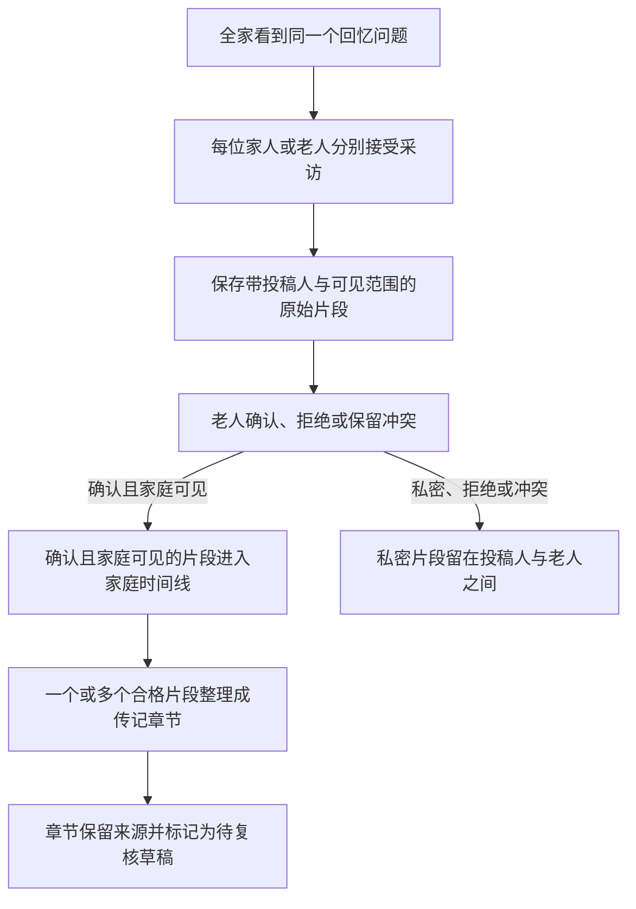

# 拾光：共享老人人生之书重设计需求

## Summary

将“拾光家忆”重塑为围绕一位老人的共享人生之书：全家看到同一个回忆问题、分别接受采访、由老人确认原始事实，再把可公开的确认片段整理成可追溯来源的传记章节。前端沿用队友原型的页面骨架和跳转成果，换成明亮国画、朦胧彩铅与大面积留白的原创视觉。

---

## Problem Frame

当前黑客松 MVP 已经跑通“家人投稿—老人确认—生成章节”的可信链路，但首页像产品介绍页，家庭房间也更像一次性表单，用户看不到“一本书正在被全家共同写出来”的持续感。另一方面，队友已经完成了人生之书首页、采访对话、叙事编辑、记忆详情和封面跳转等原型；如果完全重做信息架构，会浪费已经成形的产品思考。

飞书 PRD 和队友原型以个人记录为主，而本项目最独特的价值是多位亲人独立讲述、老人拥有事实确认权。两者需要合并，但不能让未经确认的说法提前影响其他家人，也不能为了漂亮界面绕过私密范围、事实状态和来源追溯。

---

## Actors

- A1. 老人／人生之书主人公：讲述自己的往事，并拥有对所有事实片段的唯一确认权。
- A2. 家庭成员：围绕共享问题独立讲述与老人有关的回忆，选择可见范围并查看公开成果。
- A3. AI 采访者与传记编辑：一次只追问一个方向，只依据允许使用的来源整理草稿，不替任何人确认事实。

---

## Key Flows

- F1. 家庭成员贡献回忆
  - **Trigger:** 家庭成员在共享首页看到今日问题并选择开始讲述。
  - **Actors:** A2, A3
  - **Steps:** 进入个人采访；AI 每轮只问一个问题；成员完成讲述并选择家庭可见或私密；片段进入待老人确认状态。
  - **Outcome:** 投稿人和老人能看到原始片段，其他家人尚看不到未经确认的内容。
  - **Covered by:** R1, R3, R5-R9

- F2. 老人讲述自己的往事
  - **Trigger:** 老人在共享首页选择讲述自己的故事。
  - **Actors:** A1, A3
  - **Steps:** 进入同一套单入口采访；AI 自然追问人物、时间、地点、事件或感受；老人完成并保存片段。
  - **Outcome:** 老人的原始讲述保留来源，并按与家人投稿一致的事实与公开规则进入内容体系。
  - **Covered by:** R2, R5-R9

- F3. 老人核对家人说法
  - **Trigger:** 老人看到待确认数量并进入核对流程。
  - **Actors:** A1, A2
  - **Steps:** 一次聚焦一条原始片段；查看投稿人、关系和可见范围；选择确认属实、说法不一致或不是这样；进入下一条。
  - **Outcome:** 只有确认且家庭可见的片段进入家庭时间线和章节来源，其余内容不公开。
  - **Covered by:** R3, R10-R13

- F4. 阅读并生成传记章节
  - **Trigger:** 用户进入人生之书或在合格片段存在时选择整理章节。
  - **Actors:** A1, A2, A3
  - **Steps:** 查看确认片段；选择一个或多个相关来源整理草稿；阅读章节；展开查看来源与生成方式。
  - **Outcome:** 用户得到可阅读、可追溯且明确标注需要复核的传记章节。
  - **Covered by:** R14-R17

---

## Requirements

**共享人生之书**

- R1. 产品首页必须以某一位老人的人生之书为核心，而不是营销介绍页或每位成员各自独立的个人书架。
- R2. 首页必须同时呈现书的当前进度、一个共享回忆问题和一个清楚的主要动作，并覆盖有内容与空状态。
- R3. 首页任务必须按身份变化：家人以贡献回忆为主，老人同时拥有讲述自己往事和处理待确认片段的入口。
- R4. 前端整体信息架构保留“人生之书、中央采访入口、记忆之家”的三段式心智模型；人生之书负责阅读与进度，记忆之家负责公开片段、家人和确认后的家庭时间线。

**独立采访与可见范围**

- R5. 全家可以看到同一个共享问题，但每个人的采访过程彼此独立，不能形成所有回答实时公开的群聊。
- R6. 产品只提供一个“回忆采访”入口，不要求用户先判断“随手记”或“回忆录”。
- R7. AI 每次只追问一个方向，并根据当前回答自然选择人物、时间、地点、事件或情感，不连续审问同一方向。
- R8. 投稿人在保存前必须清楚选择“家庭可见”或“只给老人”；选择结果不能只靠颜色表达。
- R9. 未经老人确认的片段只对投稿人和老人可见；私密片段无论确认状态如何，都不能进入家庭时间线、传记章节或模型请求。

**事实确认与来源边界**

- R10. 只有老人角色可以把片段标记为确认、拒绝或冲突，发起者、其他家人和 AI 均不能代替确认。
- R11. 老人确认页必须一次聚焦一条片段，并显示投稿人、关系、原始文字和可见范围。
- R12. 只有“已确认且家庭可见”的片段可以进入公开家庭时间线、章节来源和模型请求；待确认、拒绝、冲突和私密片段均不得进入。
- R13. 来源集合在生成期间发生变化时，旧生成结果必须被丢弃，不能覆盖新的确认状态。

**回忆片段与传记章节**

- R14. 已确认且家庭可见的内容先以可追溯的回忆片段进入家庭时间线，而不是直接消失在一篇 AI 文章中。
- R15. 一个或多个合格片段可以被整理成章节；黑客松版本不要求自动主题聚类，但不能使用不合格来源补足篇幅。
- R16. 章节必须展示来源数量并能追溯到投稿人；AI 生成内容必须标记为需要家人复核的草稿。
- R17. 云 AI 不可用时只能展示透明的本地演示整理，不能把规则拼接结果冒充为 AI 创作。

**队友原型、视觉与老人可用性**

- R18. 重设计必须把队友的页面布局与跳转原型作为结构依据，保留书封面、共享问题、有内容／空状态、采访对话、生成阅读、详情页和封面分区跳转等已完成思路，再适配新的角色与事实规则。
- R19. 视觉必须使用原创的明亮国画与朦胧彩铅语言：大面积宣纸感留白、玉石绿／湖水蓝／杏黄／珊瑚红等鲜明色彩、抽象概括和轻微弥散；不能直接复制带水印参考图或把第三方素材作为运行资源。
- R20. Logo 必须是原创的“双鸟相伴”符号，小尺寸仍可辨认，用于表达陪伴、亲情与代际连接；Logo 与封面插画必须作为不同资产设计。
- R21. 艺术肌理只能服务于封面、氛围区、空状态和少量插花；长文、聊天输入和事实确认区必须保持高对比度、大字号、明确触控区域与稳定布局。
- R22. 设计必须遵守原生微信小程序的胶囊区、安全区、键盘、页面返回和真机触控约束，不能把网页原型原样嵌入或照搬。

---

## Acceptance Examples

- AE1. **Covers R3, R4.** 同一本人生之书由家人打开时，主要动作是贡献回忆；由老人打开时，页面同时突出讲述与待确认任务，但两者仍进入同一内容体系。
- AE2. **Covers R5, R9.** 两位家人分别回答同一个问题时，任何一方在老人确认前都看不到另一方的采访内容。
- AE3. **Covers R8, R9, R12.** 家人选择“只给老人”后，老人可以查看和处理该片段，但其他家人、家庭时间线、章节和模型请求始终看不到它。
- AE4. **Covers R10-R12.** 家人提交一条家庭可见片段后，只有老人确认属实，它才出现在公开时间线；选择冲突或拒绝均不会公开。
- AE5. **Covers R13.** AI 生成章节期间又有一条来源被取消确认时，生成中的旧结果不会覆盖当前状态，用户需要基于最新来源重新生成。
- AE6. **Covers R14-R17.** 至少存在一个合格片段时，用户可以生成章节并查看来源；没有合格片段时，界面解释缺少可用来源而不生成虚构内容。
- AE7. **Covers R18-R21.** 新首页仍能辨认出队友原型的书封面、今日问题和内容列表结构，但不再使用深棕旧纸作为主视觉，也不会让彩色肌理降低正文或按钮对比度。
- AE8. **Covers R20, R22.** 双鸟 Logo 在微信小程序导航或头像级尺寸下仍清楚可辨，不含原参考图的签名、水印或完整绘画构图。

---

## Success Criteria

- 新用户进入首屏后能立即说出“这是全家一起为某位老人写的一本书”，并知道自己当前最重要的动作。
- 家庭成员能完成“看到问题—独立采访—选择可见范围—提交”的闭环，老人能完成逐条确认闭环。
- 未确认、私密、拒绝和冲突内容不会出现在公开时间线、章节或模型请求中。
- 用户能从章节追溯到原始投稿人与来源数量，并能分辨 AI 草稿和本地演示整理。
- 新界面保留队友原型的主要结构与跳转价值，同时在真实微信开发者工具截图中呈现鲜明、轻盈、老人可读的原创视觉。
- 现有自动化测试继续通过，并为“未经确认不向其他家人公开”的新规则提供测试证据。

---

## Scope Boundaries

### Deferred for later

- 真实微信身份、一次性家庭邀请、跨设备云数据库与生产级访问控制。
- 语音转文字、照片理解、订阅提醒和完整内容管理后台。
- 自动主题聚类、多章节目录、印刷出版和插画书自动排版。
- 对队友原型中长按菜单、完整个人档案管理和所有分享支线的全面实现。
- 黑客松结束后与 Drinking-Time 的整合。

### Outside this product's identity

- 把产品做成所有成员实时看到彼此答案的普通家庭群聊。
- 让 AI 代替老人裁定事实、自动消除冲突或补造传记细节。
- 让每位家庭成员各自经营一套与老人无关的通用日记产品。
- 以模仿具体画作为目标，复制第三方水印、签名或受保护素材。

---

## Key Decisions

- 共享对象是一位老人的人生之书：这与“让某位老人的一生被全家共同记住”的最初目标一致。
- 共享问题、独立采访、确认后公开：兼顾家庭参与感、独立证词和隐私。
- 单一采访入口：减少老人和家人的选择成本，把差异交给提问策略处理。
- 先确认原始事实再生成：比直接确认 AI 文章更容易发现具体错误，也保持来源可信。
- 片段与章节并存：既展示共同积累过程，又保留“最终成为一本书”的仪式感。
- 延续队友原型的结构、替换产品语义和视觉：保护团队已有投入，同时让原型符合新的核心价值。

---

## Dependencies / Assumptions

- 队友的两份原型已作为不可变设计参考保存在 `docs/references/team-prototypes/`；它们是结构参考，不是小程序运行代码。
- 用户提供的两张视觉参考图带有第三方水印，只用于提取双鸟、点彩、彩铅、留白和弥散等视觉特征，不提交为产品素材。
- 当前黑客松仓库已有老人确认、可见范围、来源筛选、异步生成保护和透明降级逻辑；新需求会改变“家庭可见但尚未确认的片段是否被其他家人看到”这一现有行为，因此必须同步更新领域测试。
- AppID、真实成员权限和微信开发者工具环境保持当前配置；真实用户上线前仍需补齐隐私授权、删除撤回和内容安全。

---

## Outstanding Questions

### Deferred to Planning

- [Affects R4, R22][Technical] 三段式底部入口采用原生 tabBar、custom-tab-bar 还是页面内固定导航，需以小程序页面栈、安全区和当前路由成本为准。
- [Affects R18-R21][Design] 最终色板、双鸟 Logo 和国画插花需要先产出两个关键屏幕的设计样张，再由用户确认后扩展全套页面。
- [Affects R15-R17][Technical] 黑客松演示使用真实云 AI、预设采访问题还是透明本地引导，需要依据现场网络与云函数配置决定，但任何降级都必须显式标注。
