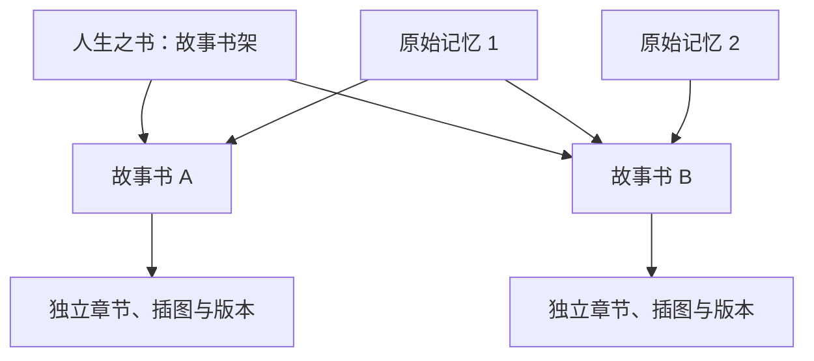

# 人生之书：一个故事一本独立的书

## Summary

将“人生之书”定义为故事书架，每个故事拥有独立的书名、章节、插图和版本。用户可以创建多本书，在“客观记录”与“AI 共创”之间选择，同时安全拆分当前混在同一书稿里的旧内容。

---

## Problem Frame

当前产品表面上展示多个“故事”，但章节书稿实际以人为单位共享。用户选中一个新故事进行整理时，新章节可能追加到旧故事的书稿中；已删除的故事或其他故事的章节也可能被展示。这让用户无法确信自己正在编辑哪本书，也会让 AI 引用错误的人物、情节和插图。

现有数据里已经存在记忆分组、书稿章节和历史版本，其归属关系不一定完整。修正新行为的同时，必须保留旧内容，并让不确定的迁移结果由用户确认，而不是静默归错或丢失。

---

## Actors

- A1. 记录者：创建和管理故事书，选择记忆，编辑章节并决定是否使用 AI。
- A2. AI 访谈者与写作助手：只在“AI 共创”模式下追问和组织叙事，并严格使用当前故事书的上下文。
- A3. 迁移流程：根据旧章节与原始记忆的已有关联拆分故事，保留无法确定的内容等待用户处理。

---

## Key Flows

- F1. 创建故事书
  - **Trigger:** A1 在人生之书中选择创建新故事。
  - **Actors:** A1
  - **Steps:** 填写故事名称；选择客观记录或 AI 共创；选择空白开始，或选择一段及以上记忆直接开始整理。
  - **Outcome:** 书架上出现一本内容与其他书完全隔离的故事书。
  - **Covered by:** R1-R5, R9

- F2. 向故事书添加内容
  - **Trigger:** A1 在某本书中添加记忆或整理新章节。
  - **Actors:** A1, A2
  - **Steps:** 选择本书内的原始记忆；按本书当前模式整理；需要 AI 时仅读取本书的记忆、章节和插图；用户审阅后保存新版本。
  - **Outcome:** 变更只出现在当前故事书中，不改动原始记忆或其他书。
  - **Covered by:** R6-R11

- F3. 切换写作模式
  - **Trigger:** A1 在已有故事书中更改客观记录／AI 共创模式。
  - **Actors:** A1, A2
  - **Steps:** 确认新模式；保留既有章节原样；后续访谈和整理采用新模式。
  - **Outcome:** 新内容符合新模式，历史内容不被静默重写。
  - **Covered by:** R9-R11

- F4. 迁移现有内容
  - **Trigger:** 已有用户首次进入新版人生之书。
  - **Actors:** A1, A3
  - **Steps:** 按章节所引用的记忆和故事关系自动拆分；将现有故事设为客观记录；把不能可靠归属的章节列为待确认；由 A1 修正归属或选择 AI 共创模式。
  - **Outcome:** 旧内容被保留，可确定的故事彼此隔离，不确定的内容对用户可见且可修正。
  - **Covered by:** R12-R15

---

## Requirements

**书架与故事边界**

- R1. “人生之书”必须是当前账号下所有未删除故事书的书架，而不是单一书稿。
- R2. 每个故事必须对应一本独立的书，拥有自己的书名、封面、章节、插图和版本历史。
- R3. 在任何一本故事书里进行整理、编辑、删除、生成插图或恢复版本时，其他故事书的内容都不得改变。
- R4. 用户必须既能创建空白故事书，也能选择一段或多段记忆直接创建并整理故事书。
- R5. 故事管理名称必须默认成为书名；用户可以单独修改书名，且之后的书名修改不得改动故事管理名称。

**原始记忆与成稿**

- R6. 同一段原始记忆必须能被多本故事书引用，不需要复制为多份内容。
- R7. 各故事书可以基于同一段记忆形成不同章节、编排和叙述角度；修改书中成稿不得反向篡改原始记忆。
- R8. 删除故事书时只删除或回收该书的封面、章节、插图和版本；原始记忆必须保留，其他故事书也不得受影响。

**写作模式与 AI 上下文**

- R9. 创建故事书时必须选择“客观记录”或“AI 共创”，并能在建书后切换；切换只影响后续访谈和整理，不自动重写已有章节。
- R10. 客观记录模式必须围绕时间、地点、人物、事件和讲述者心情组织内容，使用清楚克制的主谓宾表达，最多增加必要的补充句，不主动追问、扩写或虚构。
- R11. AI 共创模式可以采用网页端的访谈与写作体验，但模型上下文只能包含当前故事书的记忆、章节和已有插图；不得自动引用其他故事书的内容。

**旧数据迁移**

- R12. 现有故事书迁移后必须默认为客观记录，并允许用户在迁移确认时将指定书改为 AI 共创。
- R13. 迁移流程必须优先根据章节已引用的记忆及其故事归属，将当前混合书稿自动拆分为独立故事书。
- R14. 当某一章无法被可靠地归属到唯一故事时，迁移流程必须保留该章并放入“待确认”，不得擅自选择、删除或隐藏。
- R15. 迁移必须保留用户已有的原始记忆、章节内容、插图和可追溯的版本；用户确认前，不可靠的自动判断不得成为不可逆变更。

---

## Acceptance Examples

- AE1. **Covers R1-R4.** 用户已有“童年”故事书时，又从两段记忆创建“我的母亲”，新生成的第一章只出现在“我的母亲”中，“童年”的章节和版本不变。
- AE2. **Covers R4, R9.** 用户创建空白客观记录故事后，书架立即显示它；用户可以稍后添加第一段记忆，而不会被强制启动 AI。
- AE3. **Covers R5.** 用户以“童年”创建故事，将封面书名改为《院子里的夏天》后，故事管理名称仍为“童年”。
- AE4. **Covers R6-R8.** 同一段关于母亲的童年记忆同时被“童年”和“我的母亲”引用时，两本书可以分别编辑各自的章节；删除其中一本书后，原始记忆和另一本书仍存在。
- AE5. **Covers R9-R11.** 一本书从客观记录切换到 AI 共创后，旧章节不变；新章节可以接受追问和叙事整理，但 AI 不能读取其他故事书的章节或插图。
- AE6. **Covers R10.** 用户在客观记录中提供“时间、地点、人物、发生的事和心情”后，系统生成克制的事实记录，不继续追问、添加戏剧冲突或自行补足细节。
- AE7. **Covers R12-R15.** 一份旧书稿同时包含“童年”和“工作岁月”的章节时，能根据已引用的记忆将明确章节分到两本客观记录故事书；一个同时引用两个故事记忆的混合章节保留在待确认中。
- AE8. **Covers R3, R11.** 当前选中故事 A 时，页面不显示已删除的故事 B 的章节，AI 也不使用 B 的文字、人物或插图生成 A 的内容。

---

## Success Criteria

- 用户可以创建至少两本故事书，分别添加记忆、整理章节、生成插图和查看历史，两本书之间不串内容、版本或 AI 上下文。
- 用户从书架进入任意故事时，能清楚识别当前书名、写作模式及其专属章节，不再看到已删除或其他故事的章节。
- 同一段记忆可安全用于多本书，且任一本书的编辑或删除都不改动原始记忆及其他书。
- 旧数据迁移后，所有已有内容都能在明确的故事书或待确认列表中找到，没有静默丢失。
- 后续计划与实现可以通过 R 编号和验收示例追溯每个产品行为，无需再自行发明故事归属、模式切换或迁移规则。

---

## Scope Boundaries

### Deferred for later

- 将多本故事书选择性汇编成一本“人生全集”。
- 出版、印刷和跨账号迁移体验的进一步扩展。
- 围绕迁移确认页的高级批量整理和自动主题分类。

### Outside this product's identity

- 把所有故事恢复为按某个人共享的单一书稿。
- 删除故事书时联动删除原始记忆。
- 让 AI 自动读取其他故事书作为背景材料。
- 切换写作模式时静默批量重写已有章节。

---

## Key Decisions

- 故事就是书：这与用户“再加一个独立故事”的心智模型一致，也消除了记忆分组和章节书稿之间的语义冲突。
- 原始记忆与故事成稿分离：同一事实可以被不同故事使用，又不会因某本书的编辑破坏史料。
- 每本书的 AI 上下文隔离：以可预期性和人物一致性优先，不让模型擅自从整个人生资料中补写。
- 两种写作模式属于故事书而不是单次生成：让用户知道当前体验会如何继续；但仍允许之后切换，且不追溯改写历史内容。
- 先自动迁移，但不猜测模糊内容：降低旧用户的手工成本，同时保留对不确定结果的最终决定权。

---

## Dependencies / Assumptions

- 原始记忆、已有章节和版本在迁移期间仍可读，且已有的记忆引用可作为自动归属的主要证据。
- 书内已有插图可继续作为当前故事的 AI 配图参考，但不跨故事使用。
- “客观记录”不依赖 AI 也能完成基本记录和成稿；“AI 共创”的可用性受已配置模型与内容安全能力约束。
- 本需求不得引入新的账号级硬绑定；后续账号迁移将以故事书的完整边界为基础单位。

---

## Outstanding Questions

### Deferred to Planning

- [Affects R3, R11][Technical] 如何让所有读取、生成、版本恢复和插图入口始终使用同一个当前故事边界，由计划阶段结合现有页面与服务接口确定。
- [Affects R13-R15][Technical] 自动迁移的可信度规则、重复执行和回退策略，需在计划阶段通过现有真实数据形态确定。
- [Affects R8][Design] 故事书的回收站入口、保留时长和恢复交互，由计划阶段与现有“最近删除”体验对齐。
