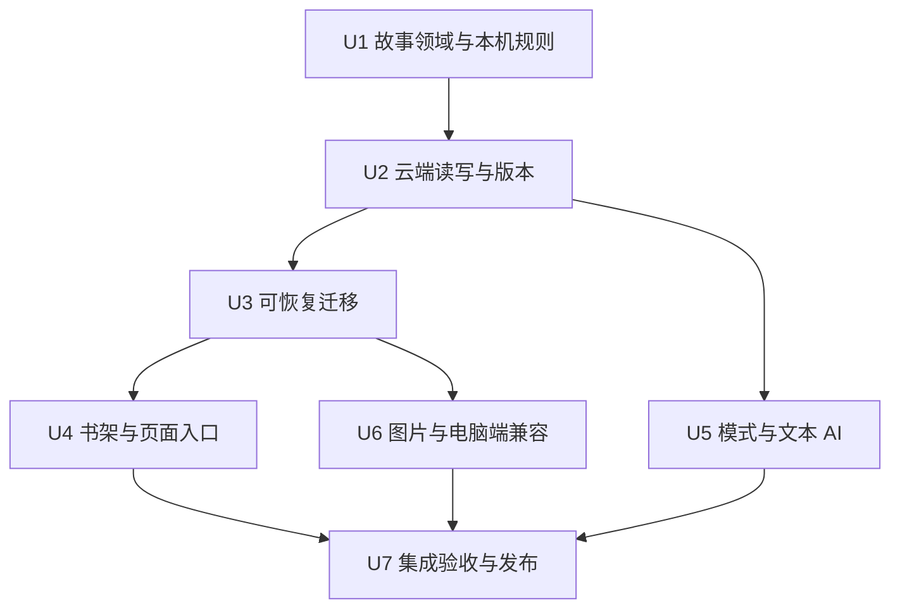

# 独立故事书实施计划

## Summary

把已定义但未落库的 Story 接入真实存储，让书架、书稿、访谈、配图、历史恢复和电脑端导出统一使用稳定的故事 ID。先完成故事级读写与迁移测试，再切换页面；保留旧书稿作为只读来源，归属不明确的章节进入可预览、可指定故事的待确认列表。

本计划对应完整的 R1–R15，不把只改书架显示视为功能完成。当前基线为 `release/2026-09-16-ai-photos` 的 `2a174d2`；规划依据是仓库代码及测试夹具，未读取真实云端内容，也未执行生产迁移。

---

## Problem Frame

`storyShelf` 按记忆名称推导故事，`manuscriptHistory` 却只按人物读取版本。新故事整理时，`book` 明确回到当前人物的旧书稿，因而新增章节会进入旧书。图片、访谈选中状态、记忆去向和电脑端快照同样未建立完整的故事边界。

源需求已确认产品结构；本计划解决持久化边界、可恢复迁移、入口一致性和验证顺序，不重新选择产品方向。

---

## Requirements

| 源要求 | 实现范围 | 单元 | 验收示例 |
|---|---|---|---|
| R1–R3 | 故事书架；独立封面、正文、版本、图片；跨书操作隔离 | U1、U2、U4、U6 | AE1、AE8 |
| R4–R5 | 空白/从记忆建书；管理名称与书名分开 | U1、U4 | AE2、AE3 |
| R6–R8 | 多书引用同一记忆；成稿独立；删除与恢复不损坏来源 | U1、U2、U4、U6 | AE4 |
| R9–R11 | 两种写作模式；切换只影响以后；AI 仅使用当前书 | U4、U5、U6 | AE5、AE6、AE8 |
| R12–R15 | 旧书默认客观记录；按证据拆分；待确认与历史可追溯 | U3、U4、U6 | AE7 |

**参与者：** A1 记录者操作和确认；A2 AI 助手受书和模式约束；A3 迁移流程只处理可证明的归属。

**流程：** F1 建书由 U1/U4 完成；F2 添加内容贯穿 U2/U4/U5/U6；F3 模式切换由 U1/U4/U5 完成；F4 迁移与确认由 U3/U4/U6 完成。U7 汇总 AE1–AE8 的跨层验证。

---

## Scope Boundaries

### Deferred for later

- 将多本故事书选择性汇编成一本“人生全集”。
- 出版、印刷和跨账号迁移体验的进一步扩展。
- 围绕迁移确认页的高级批量整理和自动主题分类。

### Outside this product's identity

- 把所有故事恢复为按某个人共享的单一书稿。
- 删除故事书时联动删除原始记忆。
- 让 AI 自动读取其他故事书作为背景材料。
- 切换写作模式时静默批量重写已有章节。

### Deferred to Follow-Up Work

- 回收站定期清理、物理图片垃圾回收及高级迁移批量操作；本次故事沿用最近删除，可恢复，不自动过期。
- 重做账号体系或电脑端产品；本次只修正现有快照的边界和身份兼容，必要时拦住不支持的新协议。

---

## Context & Research

| 现状证据 | 实施含义 |
|---|---|
| `miniprogram/domain/biography.ts` 已有 Story；FamilyRoomState 未包含 stories，版本没有 storyId | 扩展现有类型，不新建第二套“书”实体 |
| `miniprogram/services/storyRecords.ts` 仅推导、不写库，familyId 暂用 roomName | 推导函数仅供迁移参考；持久化使用真实空间身份；不得把房间名写作账号边界 |
| `miniprogram/services/manuscript.ts` 先读后写；`saveCloudManuscriptRevision` 使用直接 set | 现有冲突检查并非原子操作；新增故事版本由服务端事务负责 |
| `miniprogram/services/cloudRoomStorage.ts` 已有分页、云端失败不回落本机的行为 | 保留错误语义和完整分页，避免把权限失败理解成空账号 |
| `miniprogram/services/storyLifecycle.ts`、`recentlyDeleted.ts` 只做软删除 | 故事删除复用回收站；改为稳定 ID，不再按标题遮蔽 |
| `cloudfunctions/storyImages/flow.js` 的 storyId 为空，查询和额度按 memberId；删除会删物理文件 | 查询、任务、额度和图片可用性都要改；旧图恢复保护需要覆盖历史版本 |
| `miniprogram/services/interviewService.ts` 本地降级仍会追问；`biographyService.ts` 默认尝试 AI | 客观记录是独立行为分支，不可把 AI 故障降级当作客观模式 |
| `miniprogram/services/drinkingTimeAccount.ts` 通过人物取整本稿 | 导出也必须按书，不可仅修小程序展示 |
| `docs/2026-09-14-story-records-plan.md` 的回退建议是忽略/删除 stories | 新写入后不可照搬；本计划以只读保护和保留新旧记录回退 |

仓库没有 `docs/solutions/` 或 `STRATEGY.md` 可复用。`tests/cloud-save-regression.test.ts` 已覆盖丢失确认、重试、分页和不降级本机，是存储故障测试的主要样板。旧的按人物混稿测试需明确改为故事隔离回归。

外部依据：[CloudBase 事务文档](https://docs.cloudbase.net/database/transaction)，2026-09-17 实际读取：事务仅服务端 Node SDK 支持，最多 100 次操作、30 秒，仅支持 doc、不支持 where；模型调用和分页查询应在事务外执行。项目目前使用 wx-server-sdk，U2 必须确认实际部署 SDK 的事务接口和返回值，不能直接复制另一 SDK 的示例。

---

## Key Technical Decisions

| 决定 | 理由与边界 |
|---|---|
| Story.id 唯一标识一本书，memberId 仅表示人物/旧来源 | 改名、换书名和多人素材都不能改变书的身份 |
| Story 保存管理名称、显示书名、模式、封面引用、记忆引用、当前版本和状态版本号 | 空书也必须落库；模式与书名不能依赖已有章节才存在 |
| 版本不可变，当前版本指针单独维护 | 保存、恢复和幂等重试有明确比较对象；恢复旧稿产生新版本 |
| 新故事写操作统一由 storyBooks 云函数处理 | 在服务端校验所有权、当前版本、故事状态和请求重复；本机适配器遵守同一领域规则 |
| 旧数据分批准备，完成校验后原子激活迁移批次 | 避免超大事务；半完成迁移不暴露为正常书架 |
| 故事软删除保留全部引用和历史，图片本轮不因删书物理清除 | 满足回收站恢复、旧版本恢复以及共享文件保护 |

### 身份与数据边界

- 复用现有账号与空间身份解析，服务端从微信上下文和账号映射确定 familyId；不得信任客户端任意指定的空间。Story.id 是不含 openid 的不透明 ID，空间是独立字段，便于后续迁移。
- `stories` 保存真实记录；继续使用 `biography_drafts` 保存带顶层 storyId 的新版本。新故事版本采用独立 draftType，避免旧客户端把它们当成人物最新版本。保留 memberId 仅用于来源说明和兼容读取。
- 管理名称沿用旧设计：去除首尾空格后在未删除故事中不重名；使用服务端唯一名称占位记录解决并发创建/改名。恢复时若同名已被占用，要求先改管理名称，不覆盖另一书。封面书名允许不同。
- `Story.memoryIds` 是多对多引用的权威来源。记忆上的旧 storyTitle 仅参与旧数据迁移和历史显示；新建、改名或添加到第二本书不得改写原始记忆的事实字段。
- 每个访问入口明确携带 storyId。没有 ID 的旧链接只能经唯一映射进入；多候选时进入书架选择，不能默认打开当前人物的某本书。已删除/不存在的 ID 返回不可用，不回退到别书。
- AI 与版本操作在云端再次校验故事边界。客户端只按书过滤不足以保证隔离；生成接口接收来源 ID，由服务器取本书数据。未保存的当前章内容/对话可作为请求内的受限编辑输入，但不能夹带另一书的历史会话。

### 版本、异步与并发

- 保存请求携带故事状态版本、预期当前稿版本和稳定请求 ID。事务读取具体故事文档，检查状态、去重、写入不可变版本并更新当前指针；相同请求相同内容返回原结果，不同内容拒绝。
- 变更模式、记忆关系和删除状态会增加故事状态版本。AI 开始时记录故事、模式、来源指纹、稿版本；返回后若任一条件变化，保留候选供用户检查，不自动覆盖新状态，不把响应写到刚切换的另一书。
- 恢复仅接受本书版本，并生成新版本；不反向改变当前写作模式、管理名称或原始记忆。恢复历史显示书名时需与新当前稿同步，保持元数据与稿件一致。
- 新建故事成功但 AI 失败时保留故事和已选记忆，显示重试整理；用户重试不得创建第二本书。新记忆已保存但关联失败时保留原始记忆并给出重试关联，不报整体丢失。

### 迁移规则与回退

1. **快照与可恢复批次：** 首次进入新版书架启动迁移；记录账号范围、迁移算法版本、源文档 ID/摘要和处理游标。进入快照阶段前设置该账号迁移维护状态，暂停会改变迁移证据的旧稿、记忆归属和删除标记写入；页面保留未提交输入并显示可重试状态。服务端与数据库规则共同执行维护限制，后台图片任务也遵守。逐页读取所有旧稿、历史、记忆、删除标记及图片任务；旧内容保持不变。分页不能只覆盖默认 20 条。
2. **建立故事：** 旧记忆标题分组可成为稳定故事候选，保存 legacy key 到新 ID 的映射。不能直接使用会过滤已删除故事的 `deriveLegacyStories` 作为完整迁移输入；已删除故事也建立记录并保留删除状态。同名不同来源不能仅靠名字合并。推导 ID 冲突时比较完整来源标识并保存稳定消歧映射，不覆盖同 hash 的另一故事。
3. **归属判定：** 对章节的全部 memoryIds 查候选集合；只有每个引用均有且仅有同一个故事归属时才自动分配。跨书、多归属、缺失引用、无引用的手写章、标题与来源证据冲突均待确认；不用章节标题、人物性别或 AI 猜归属。已软删除但仍存在的记忆可作归属证据，不在正常素材选择中复活。
4. **历史完整性：** 保存每份原始版本的来源关系；逐版本投影为相应故事的历史。最新版本里已删除的章不能因旧历史仍有它而出现在当前稿。每个旧章版本必须落到某书的历史或待确认记录；不把所有历史章节拼到当前书。没有 chapters 的平面稿作为可追溯待确认项保留。
5. **图片与封面：** 由章 ID、正文引用、底图/封面引用及图片元数据联合确定归属。新图严格归属一个 storyId；旧文件可能被多份历史引用，保留资源及每书引用映射。无引用但元数据能唯一定位已迁移章的图片归入该书；其余图片列入待确认资源，不隐藏。待处理旧生成任务先完成或转入可见的保留状态，再激活迁移；unknown 任务保留请求来源并禁止自动再次付费，不能无限阻塞整个账号迁移。
6. **分批与激活：** 迁移输出采用可重复计算的 ID，批次尚未激活时对普通读取不可见。准备完成后核对来源仍与快照一致、核对内容/历史/图片覆盖，最后通过小事务激活批次并解除新入口的维护限制；来源改变则重试差异部分，不重复建立已编辑故事。失败批次可以恢复；管理员取消尚未激活的迁移时，保留来源与准备结果并解除临时维护状态，不能让用户长期无法记录。
7. **用户确认：** 待确认页显示完整章节预览、来源记忆、原因、历史入口和候选书。用户可指定已有书或新建书，也可暂时保留；目标书中追加独立章并生成版本，保留来源映射。已确认条目再次提交不会重复追加；并发编辑目标书时提示刷新。
8. **保护旧写入：** 上线迁移前部署可识别账号迁移状态的数据库规则；激活后的账号阻断旧 draftType 的客户端写入，新增故事、迁移输出及版本仅云函数可写。短暂维护期间冻结必要的来源字段，激活或取消准备后恢复原始记忆正常保存；未迁移账号继续原有行为。旧应用不能继续修改被冻结旧稿；其错误提示和升级路径纳入真机验收。没有这道部署门槛不激活迁移。
9. **失败与回退：** 准备失败可重试并读取旧数据，状态页明确尚未完成。激活后若需停用新版，暂停写入并提供新旧只读内容；不删除新集合、不切回可写的人物共享稿。源快照和已产生的新版本均保留，待修复后继续。

迁移后的现有故事统一为客观记录；用户可在迁移结果/故事设置中切换为 AI 共创。没有用户确认的模糊映射不会进入有效书稿。

### 写作与交互

- 空白建书：名称、书名默认值、明确模式选择；保存后立即出现在书架，不启动访谈或生成。封面先复用既有默认书封，允许在本书可用图片中选择自定义封面。
- 从记忆建书：从原始记忆库多选，创建一本书并关联所选 ID，然后按所选模式整理第一章。两种创建入口共享同一持久化流程。
- 客观记录：提供可选的时间、地点、人物、事件、心情输入/原文记录；缺项允许留空，不主动问下一题。按用户已提供的内容做本地确定性编排，不调用追问模型、不添加模板虚构句。历史 AI 内容保留原样。
- AI 共创：沿用现有访谈与成稿能力，补齐当前书上下文；不得只凭“网页端式”字样引入未验证的另一套引擎。当前书已有图可作为参考，明确标识引用，沿用授权与审核规则。
- 模式切换需清晰确认，新模式仅影响后续请求。正在生成的旧模式候选不会自动采用；客观模式首页/继续讲入口也不触发每日 AI 追问。
- 列表区分管理名称与封面书名，打开书后始终显示当前书名和模式。载入失败不显示空书；创建失败保留输入；故事不存在显示返回书架；空书提供添加记忆入口。

---

## Implementation Units

依赖关系如下；单元按依赖顺序交付，最后统一启用，不能只上线部分客户端路径。

### U1. 故事实体、引用与本机存储

**Goal:** 空故事可以持久化，书稿只按故事读取，原始记忆可被多书引用。

**Requirements:** R1–R9、R12；F1、F3。

**Dependencies:** 无。

**Files:** 修改 `miniprogram/domain/biography.ts`、`miniprogram/services/storyRecords.ts`、`miniprogram/services/storyShelf.ts`、`miniprogram/services/storySelection.ts`、`miniprogram/services/storyLifecycle.ts`、`miniprogram/services/recentlyDeleted.ts`、`miniprogram/services/roomStorage.ts`、`miniprogram/services/manuscript.ts`；新增 `miniprogram/services/storyBooks.ts`；测试 `tests/story-records.test.ts`、`tests/story-shelf.test.ts`、`tests/story-lifecycle.test.ts`、`tests/room-storage.test.ts`、`tests/independent-story-books.test.ts`（新）。

**Approach:** 扩展 Story/FamilyRoomState/ManuscriptRevision；添加书名、模式、当前稿指针与来源信息。明确区分旧稿读取函数和故事稿读取函数，新故事缺稿时返回空书，不能自动调用旧按人物回退。本机操作复用纯函数校验与一份完整状态写入，保持原存储失败语义。

**Patterns to follow:** 现有生命周期纯函数、`copyChapter` 深拷贝、原始记忆和成稿分离。

**Test scenarios:**
- Covers AE2/AE3：空书可重开；改书名不改管理名称；两本书属于同人物仍独立。
- Covers AE4：同一记忆被两本书引用，改稿/删书/恢复不改变记忆及另一本书。
- 非法、缺失或已删除 storyId 拒绝；同名管理名称冲突；旧缓存没有 stories 时仍可迁移。
- 旧稿不可作为新空书的默认正文；切换模式不改历史内容。

**Verification:** 本机真实存储适配器往返后，独立身份、引用、删除和模式均保持；旧读取路径仅用于迁移/只读来源。

### U2. 云端故事边界与原子版本保存

**Goal:** 云端创建、改名、关联、切换模式、删除恢复、保存恢复版本均由服务端验证。

**Requirements:** R1–R9、R11、R15；F1–F3。

**Dependencies:** U1。

**Files:** 新增 `cloudfunctions/storyBooks/index.js`、`cloudfunctions/storyBooks/core.js`、`cloudfunctions/storyBooks/repository.js`、`cloudfunctions/storyBooks/package.json`、`cloudfunctions/storyBooks/config.json`；修改 `miniprogram/services/storyBooks.ts`、`miniprogram/services/roomRepository.ts`、`miniprogram/services/cloudRoomStorage.ts`、`miniprogram/services/manuscript.ts`、`cloudfunctions/ensureCloudCollections/bootstrap.js`、`cloudfunctions/resetCurrentUserRoom/index.js`、`deploy/wechat-cloud.manifest.json`；新增 `tests/story-books-cloud.test.js`、修改 `tests/cloud-save-regression.test.ts`、`tests/cloud-function.test.js`。

**Approach:** 沿用微信上下文/账号映射，增加 stories、迁移记录和唯一名称占位集合。列表和版本分页读取；每次写入校验所有权、状态版本和预期当前稿。仅具体 doc 读写进入事务；外部内容审核在事务外进行，落库时重新验证相关版本。新集合规则限制为云函数写入，读操作经过身份验证的接口。部署清单记录集合、权限和实际查询所需索引。既有“清空当前账号”功能须纳入新集合及迁移状态；服务器清空失败时不得执行遗漏新数据的客户端清空回退。此处只修改并测试能力，不执行用户账号清空。

**Execution note:** 先写两个设备同时保存同一本书和不同书的故障测试，再实现存储边界。

**Patterns to follow:** `familyInvite` 的身份验证；现有云存储分页及不回落本机；`storyImages/flow.js` 的依赖注入可测试结构。

**Test scenarios:**
- Covers AE1：同一人物下 A/B 分别写入，只更新各自当前指针和历史。
- 同一本书两个请求基于旧版本并发，只允许一个成为新当前稿；不同书不互相冲突。
- 响应丢失后同请求重试不重复建书/版本；相同请求 ID 不同内容拒绝。
- 跨账号或已删故事的读取、关联、版本恢复拒绝；不能通过伪造 familyId 越界。
- 保存过程任一步失败不留下已生效的半版本；网络错误不回落本机；超过一页的记录全部可读。
- 云能力未部署时明确提示升级/暂不可用，不静默走旧按人物保存。
- 仅对合成夹具验证账号清空后不存在孤立故事、版本、名称占位或迁移任务；失败不错误宣称已清空。

**Verification:** 使用真实领域逻辑与事务适配器契约测试证明冲突、幂等及隔离；在发布测试环境验证所用 SDK 的事务行为和数据库规则。

### U3. 旧稿拆分、历史投影与待确认数据

**Goal:** 保留每份旧内容与图片来源，安全生成独立故事及待确认项，支持中断重试。

**Requirements:** R12–R15；F4。

**Dependencies:** U1、U2。

**Files:** 新增 `cloudfunctions/storyBooks/migration.js`、`miniprogram/services/storyMigration.ts`、`tests/story-migration.test.js`；修改 `storyBooks` 云端入口/适配器、`miniprogram/services/storyRecords.ts`、`tests/story-records.test.ts`、`tests/cloud-save-regression.test.ts`。

**Approach:** 实现上述快照、证据、稳定输出 ID、批次激活和来源覆盖核对。迁移规划器是纯函数；云端逐批执行，本机适配器使用相同规则或同一夹具契约。确认待定章时写入目标书新版本并记录确认结果；来源保持只读。

**Execution note:** 先建立混合稿、历史删章、同名故事、已删除记忆、缺失引用、平面稿和图片引用夹具，逐项确认迁移预期，再实现变换。

**Patterns to follow:** `deriveLegacyStories` 的稳定 ID 思路与 `chaptersOf` 的兼容读取，但修正其过滤删除内容和仅看当前稿的局限。

**Test scenarios:**
- Covers AE7：两故事明确章节分别入书，混合章节待确认；所有迁移书默认客观记录。
- 空引用、缺失记忆、同一记忆多书归属、冲突标题均不猜测；删除状态不丢失。
- 当前稿已移除而历史存在的章节仅进历史；平面稿文字和照片全部可追溯。
- 两次运行结果一致；每个批次写前/写后中断均可恢复；确认应答丢失不重复加章。
- 来源快照变化时不激活过期结果；有新编辑的故事不被迁移重跑覆盖。
- 跨历史共享图片仍可读；未引用旧图进入待确认；迁移前后每个章节版本和图片有可查去向。

**Verification:** 源数据逐字段不变，输出覆盖清单无静默遗漏；真实服务/存储夹具故障注入下仍可恢复。

### U4. 书架、书稿及所有导航入口

**Goal:** 用户完整执行建书、添加素材、编辑、恢复、模式设置、封面选择和迁移确认。

**Requirements:** R1–R9、R12–R15；F1–F4。

**Dependencies:** U1–U3。

**Files:** 修改 `miniprogram/pages/stories/stories.{ts,wxml,wxss}`、`miniprogram/pages/book/book.{ts,wxml,wxss}`、`miniprogram/pages/index/index.{ts,wxml}`、`miniprogram/pages/archive/archive.{ts,wxml}`、`miniprogram/pages/recall/recall.ts`、`miniprogram/pages/interview/interview.{ts,wxml}`、`miniprogram/services/manuscript.ts`、`miniprogram/services/storySelection.ts`；新增 `miniprogram/pages/story-migration/story-migration.{ts,wxml,wxss,json}` 并登记 `miniprogram/app.json`；测试 `tests/page-handlers.test.ts`、`tests/story-switcher.test.ts`、`tests/memory-home.test.ts`、`tests/ui-contract.test.ts`、`tests/story-migration-page.test.ts`（新）。花括号表示同名的具体文件，不要求新增不存在的样式文件。

**Approach:** 沿用现有微信原生控件和页面视觉。书架加入两种建书入口；详情显示名称/书名/模式，空书可添加记忆；设置支持封面与模式。选中状态持久化 storyId。整理书的切换真正切换读写目标，删除按书操作。记忆库“写进哪本书”携带 storyId，支持多书关联且不因删书隐藏原始记忆。统一处理加载/失败/并发/重复点击与跳转。

**Patterns to follow:** 现有最近删除弹层、编辑器失焦处理和书稿候选审阅流程；不重新设计全站导航。

**Test scenarios:**
- Covers AE1–AE4：空白/所选记忆建两书、分别保存重开、改书名、复用记忆、删书恢复全链路。
- Covers AE7：待确认章可预览、指定已有/新书、暂不处理、错误后重试；模式可在结果页更改。
- Covers AE8：首页、书架、记忆去向、继续讲、历史恢复、旧链接都不能进入另一书或已删书。
- 空选、重名、重复点击、加载失败保留输入；创建成功而整理失败只保留一本书并可重试。
- 从 A 发起加载/生成后切到 B，迟到回调不能修改 B 的标题、编辑器、历史和插图选择。
- 书稿手改后与云端冲突，保留本地编辑内容并提示刷新，不静默覆盖。

**Verification:** 页面 handler 集成测试贯穿真实故事服务；微信开发者工具和真机检查书名、模式、正文光标及空书交互。

### U5. 客观记录与 AI 共创的请求边界

**Goal:** 客观记录无需模型并停止追问；AI 共创只使用当前书，模式切换不重写历史。

**Requirements:** R9–R11；F2、F3。

**Dependencies:** U1、U2；页面联调在 U4 后。

**Files:** 修改 `miniprogram/services/interviewService.ts`、`miniprogram/services/biographyService.ts`、`miniprogram/services/memoryOrganizerService.ts`、`miniprogram/domain/biography.ts`、`miniprogram/domain/interview.ts`、`miniprogram/pages/interview/interview.{ts,wxml}`、`miniprogram/pages/book/book.ts`、`miniprogram/pages/index/index.ts`、`cloudfunctions/chatInterview/index.js`、`cloudfunctions/generateBiography/index.js`、`cloudfunctions/organizeMemory/index.js`；测试 `tests/interview-service.test.ts`、`tests/biography-service.test.ts`、`tests/interview.test.ts`、`tests/page-handlers.test.ts`、`tests/cloud-function.test.js`，新增 `tests/story-ai-boundary.test.js`。

**Approach:** 从持久化的书模式分流。客观输入通过本地确定性格式整理，不请求 AI 授权、不调用追问/润色模型；显式生成插图仍由用户触发并走既有授权。AI 云端根据 storyId 和选中来源 ID 组装上下文，校验既有章节/版本归属，限制长度并优先当前章。对话和草稿缓存以故事为键；切书隔离；模式变化使未完成候选需要重新确认。AI 失败给出明确提示，不伪装为 AI 成功。

**Patterns to follow:** 现有 consent、内容审核、成稿候选和本地草稿生成；保留用户原话，删除会自行补事实的模板路径。

**Test scenarios:**
- Covers AE6：仅输入事件和心情也可保存；不补时间人物，不产生后续问题，所有文本模型调用计数为零。
- Covers AE5：切换模式后旧稿逐字段不变，新请求使用新模式；切换期间返回的旧候选不自动入稿。
- Covers AE8：A/B 放入可识别测试标记，AI 请求和本地回退均不含 B 的记忆、章节或会话；伪造来源 ID 在服务器拒绝。
- 新建书首次共创、同记忆多书的不同叙述各自保存；拒绝 AI 授权、超时、无效模型输出不损坏当前稿。

**Verification:** 检查实际组装给模型的 payload（测试夹具，不记录真实隐私正文）；离线客观记录从输入到成稿可完整运行。

### U6. 图片生命周期与电脑端快照

**Goal:** 图片和导出遵循同一故事边界，旧图/旧版本仍能恢复。

**Requirements:** R2、R3、R8、R11、R15。

**Dependencies:** U2、U3；页面联调在 U4 后。

**Files:** 修改 `cloudfunctions/storyImages/{core,flow,index}.js`、`miniprogram/services/storyImageService.ts`、`miniprogram/services/chapterBackdrop.ts`、`miniprogram/services/drinkingTimeAccount.ts`、`miniprogram/services/localImport.ts`、`miniprogram/pages/story-images/story-images.{ts,wxml}`、`miniprogram/pages/book/book.ts`、`cloudfunctions/drinkingTimeBridge/core.js`、`deploy/wechat-cloud.manifest.json`；测试 `tests/story-images.test.js`、`tests/story-images-page.test.ts`、`tests/chapter-backdrop.test.ts`、`tests/drinking-time-account.test.ts`、`tests/drinking-time-bridge-contract.test.js`、`tests/local-first.test.ts`。

**Approach:** 图片 submit/list/status/remove、参考图、额度和任务幂等键全包含故事边界；按书验证章节和当前稿，允许显式选择本书其他章节已有插图作参考。保留既有日额度，单书额度改按 storyId。迁移旧图通过引用映射兼容读取。常规删除图片先检查当前稿、封面、所有保留历史及其他书资源引用；仍被引用时拒绝物理删除。后台推进任务前重查故事状态；已删除故事不发起新的付费生成，已付费结果保留在回收范围。

电脑端快照仅包含选定书。稳定新 sourceKey 与旧 key 的映射必须在既有接收端合同允许范围内传递；唯一一对一关系才声明旧 key 别名，一本旧混稿拆多书不能把同一旧 key 冒充多书身份。旧接收端不支持映射时明确阻止歧义同步，不静默导出混稿或生成重复记录；U7 将正常无歧义导出及此提示纳入验证。

既有 `localImport` 只重映射人物和旧版本，不支持完整新故事。本次在检测到新 stories/迁移批次时明确拒绝走该旧导入器，并保留本机原状态；完整跨账号/跨存储导入继续属于后续范围，不能静默丢掉新书。

**Patterns to follow:** 现有图片任务 claim/重试/未知状态处理、photo-ai 引用、参考图能力协商、bridge 合同测试。

**Test scenarios:**
- Covers AE8：同人物 A/B 使用相同章节 ID，list/status/参考图/删除仍隔离；跨书参考拒绝。
- 历史引用或封面引用的图不能物理删除；删书再恢复，正文/底图/封面仍可用；共享旧文件不误删。
- 本书其他章节参考图可用；书额度与账号日额度正确；旧任务重试不重复计费。
- A 生成途中被删/切书，不把结果展示到 B；网络中断遵守既有 unknown 状态。
- 电脑端快照不存在其他书标记；改书名不改变身份；多书拆分的旧 key 歧义显式报出。
- 旧本机导入器遇到新版故事状态时明确拒绝且无写入，旧格式仍保持原合同。

**Verification:** 图像流程使用 provider/storage 测试替身完成，隔离和持久化逻辑真实执行；本单元测试不产生付费出图。

### U7. 完整验收、发布与可恢复交付

**Goal:** 确认所有入口和迁移均符合源需求，再启用新版。

**Requirements:** R1–R15；AE1–AE8。

**Dependencies:** U1–U6。

**Files:** 新增 `tests/independent-story-books-integration.test.ts`、`docs/independent-story-books-rollout.md`；更新 `docs/cloud-demo-test-guide.md`、`deploy/wechat-cloud.manifest.json`，按实现修订失效的旧计划说明。

**Approach:** 跑类型检查及现有完整回归；进行覆盖存储、云函数、页面、迁移、AI 请求的正式代码审查。建立带 A/B 标记的合成账号夹具，完成所有 AE 和故障重试。验证部署 SDK、索引、权限和桥接兼容，生成可检查预览。真实迁移先给出只读清单并保留备份，再小范围激活；记录批次、来源/目标数、待确认数、失败原因，不记录正文或密钥。

**Patterns to follow:** 现有云保存回归和页面 handlers；发布清单仅记录环境变量名称。

**Test scenarios:**
- Covers AE1–AE8：通过真实领域/服务调用完成两书创建、编辑、图片引用、模式切换、删除恢复、混合旧稿迁移及历史回溯。
- 模拟断网、失败确认、并发保存、切书响应竞态、旧客户端写入、超过一页数据和迁移重入。
- 使用无模型/无网络环境确认客观模式可成稿；AI 路径测试不同书标记不进入 payload。
- 真机检查编辑器中间位置插图、保存重开、键盘/弹窗、待确认长文阅读以及删除恢复。

**Verification:** 每项 AE 有具体测试或真机证据；无静默丢内容、无跨书上下文、无重复付费；生产启用前云端所有依赖已就绪。

---

## System-Wide Impact

- 书架、首页、记忆库、回忆入口、访谈、书稿编辑器和配图都通过故事 ID 连接；人物切换不再决定当前书稿。
- 数据错误向上明确传播，云端读失败不展示本机空状态。异步请求绑定发起时故事和状态版本，防止切书污染。
- 原始记忆的分享、审核、照片访问规则继续有效，关联到书不扩大权限；恢复历史保留已保存成稿，不能借恢复重新取回无权限的原始素材。
- 新 API 同时支持页面可执行的操作；云函数不能仅依赖按钮禁用来验证边界。旧客户端、旧深链和电脑端通过能力检查/唯一映射兼容。
- 新书读写不再按 savedAt 排序猜当前版本；排序只用于历史展示，避免设备时钟差异决定覆盖顺序。

---

## Risks & Dependencies

| 风险 | 处理 |
|---|---|
| 当前真实数据与夹具不同 | 先只读清单、保留来源快照；未知形态待确认，不以测试通过替代真实迁移检查 |
| 旧客户端继续写旧稿 | 按账号迁移状态限制旧稿写入；原始记忆仅在快照维护期限制，失败可恢复或取消准备 |
| 服务端版本事务与 SDK 不一致 | U2 小型适配器契约验证；不能降级成先读后写 |
| 多版本/图片使迁移超时 | 小批次、稳定游标、doc 事务、覆盖核对后激活，不在事务中调用模型 |
| 文件在历史恢复前被删 | 保留历史引用保护；本轮不因故事删除做物理清理 |
| 模式切换/切书时 AI 回来 | 请求携带故事、模式和版本快照；不自动采用过期候选 |
| 电脑端旧身份协议不支持拆书 | 明确兼容能力和歧义提示，不以跨仓大改作为隐含依赖 |

---

## Open Questions

### Resolved During Planning

- 当前书边界：稳定 storyId 从路由贯穿服务/云函数/版本/图片；成员 ID 不可作书 ID。
- 迁移可信度：每个来源引用均唯一指向同一本书才自动归属；其余可见待确认。
- 重复执行与回退：稳定迁移 ID、分批准备、激活屏障；保留源数据和新版本，不删除新集合来回退。
- 最近删除：复用已有入口，故事不自动过期，也不自动清理物理图片。
- 执行路径：按现有用户授权在已接管工作树实现，无需再次选择分支或重复确认产品需求。

### Deferred to Implementation

- 云端实际 SDK 版本、事务接口及现有数据库规则：在 U2 的测试环境验证，结论写入发布文档；不在本机规划阶段假设已部署。
- 真机原生编辑器跨页行为：U4/U7 实测；沿用已修复的用户选位置再插入方式。
- 电脑端实际接收协议是否识别 legacy alias：U6 核对合同与可用能力；歧义情况下阻止同步是本计划明确的保底行为。
- 真实旧数据异常数与迁移批次规模：发布前只读检查，不影响上述无损原则。

---

## Documentation / Operational Notes

部署顺序：建集合/索引与规则 → 部署 storyBooks 及故事感知的文本/图片函数 → 合成账号迁移验收 → 预览客户端及真机验收 → 来源备份与只读迁移清单 → 冻结旧稿写入并激活迁移 → 观察保存冲突、待确认项和图片异常。

迁移能力未就绪时，新客户端保持只读旧稿并显示状态；不把部分实现当作可用新版。任何一次付费出图由明确测试动作触发，回归不自动调用付费模型。首次真实启用后，回退是暂停写入与保留访问，不是恢复旧的可写混稿逻辑。

## Sources & References

- Origin：`docs/brainstorms/2026-09-17-independent-story-books-requirements.md`。
- 旧设计：`docs/2026-09-14-story-records-plan.md`，仅复用身份与引用原则；其懒迁移/删除集合回退不适用本需求。
- 迁移与故障案例：`tests/cloud-save-regression.test.ts`、`tests/story-records.test.ts`。
- 图像与同步边界：`cloudfunctions/storyImages/flow.js`、`miniprogram/services/drinkingTimeAccount.ts`。
- 事务约束：https://docs.cloudbase.net/database/transaction 。
