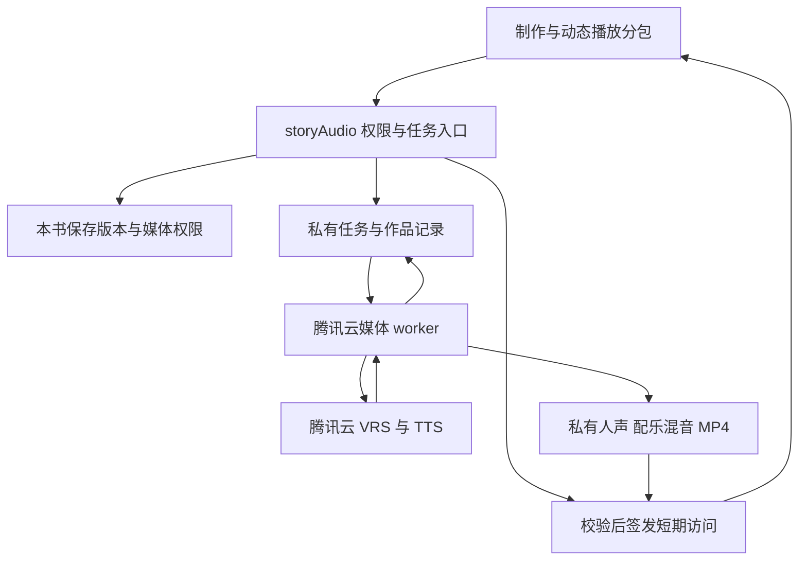

# feat: 有声动态故事页与视频导出

## Summary

在现有独立故事书上增加按需加载的声音制作与动态播放页面，以固定书稿版本生成音频作品。新增腾讯云声音任务云函数和独立媒体处理容器，将本人声音复刻、分段朗读、混音与竖屏视频导出接到同一份作品和时间轴上。

本计划可开始本地实现；真实生成和发布以账号能力、费用、授权样本、数据库规则及真机验证为门禁，不把模拟服务验证计为上线完成。

### 2026-09-18 实施进度

- 已实现并部署官方音色最小链路：保存章节快照、持久化分段、腾讯云 `TextToVoice`、私有 WAV 片段、合并成品、临时播放地址、前端自动轮询与动态文字播放。
- 已将实际接口不接受的 24 kHz 修正为腾讯基础合成支持的 16 kHz；所有 524 项测试、TypeScript 检查和 diff 格式检查通过。
- 已用真实账号的「壮壮」章节调用云端：任务可从 `queued` 进入 `processing`，腾讯云返回 `AuthFailure.UnauthorizedOperation`。当前唯一的真实音频阻塞是账号／运行角色未开通 `tts:TextToVoice`；代码已将它安全落为 `TTS_PERMISSION_REQUIRED`，不自动重复付费提交。
- 当前只能将「官方音色链路已实现」视为完成；在腾讯云权限开通并产出可播放成品前，U1/U4 仍不验收，本计划保持 `active`。本人声音、配乐和视频仍按原顺序在官方音色实测后开放。

---

## Problem Frame

用户希望用自己的声音讲述保存的文章，日常边听边看文字轻动画，需要时输出视频。现有小程序具备章节、照片和异步配图，但没有有声作品与音色管理；独立故事书的云端迁移仍未开放。

需求以 origin 为准。首版按单篇／单章、中文、轻动画、授权现成背景音、竖屏视频设计；不接电脑端 AI 供应商。

---

## Requirements

| Origin 要求 | 实施覆盖 |
| --- | --- |
| R1-R3：当前书稿、固定版本、原文朗读及独立授权 | U2、U4、U5 |
| R4-R7：本人复刻、录音授权、检测、停用和删除 | U1、U2、U3、U5 |
| R8：配乐试听、音量、关闭及复用人声 | U4、U5、U6 |
| R9-R11：文字照片动画、真实同步、播放生命周期 | U1、U5、U6 |
| R12：持久化任务、恢复及防重复付费 | U2-U4、U6 |
| R13-R14：一致视频、异步渲染、下载保存 | U6、U7 |
| R15：作者／读者／音色权限及删除 | U2、U3、U6、U7 |
| R16-R18：腾讯云、费用、真实状态及合成标识 | U1、U3-U7 |

**Origin actors:** A1 为作品制作和导出者、音色本人；A2 只按既有可证明的内容权限读作品；A3 为腾讯云服务。亲友身份不等于整章阅读权或音色使用权。

**Origin flows:** F1 本人音色由 U3/U5 实现；F2 制作和播放由 U2/U4/U5/U6 实现；F3 更新与导出由 U2/U6/U7 实现。AE1-AE10 在下文测试场景中对应。

---

## Scope Boundaries

- 完成自己的声音、动态页和视频导出全链路；官方音色仅为自选替代，不能替代本人复刻验收。
- 不改电脑端仓库、供应商和账号，不新增支付系统或音色市场，不做多人对白、AI 配乐、复杂时间线编辑或整书自动串联。
- 不顺手重构故事迁移或改变原有云端／本地存储选择。有声入口只能使用已经明确归属、保存成功的故事版本；未激活故事库显示原因，不由该入口自动触发真实迁移。
- 独立故事书已有发布清单继续有效；其规则与迁移验证是本功能生产前置条件，不把这些尚未验证的部分描述成已完成。

---

## Context & Research

### 本地依据

- 原生微信小程序，TypeScript 5.9 系列，测试使用 Node test / tsx；云函数采用 CommonJS 和 wx-server-sdk。新增服务沿用依赖注入和可测试业务流程。
- `cloudfunctions/storyBooks/index.js`、`flow.js`：服务端故事读取、事务版本保护；`miniprogram/services/storyBooks.ts`：客户端命令和版本入口。
- `cloudfunctions/storyImages/flow.js`：任务先落库、生成与转存分离、未知结果不盲重试；`index.js` 的事务抢占和 `config.json` 的定时补查可借鉴。新音频查询仅查状态，不照搬“用户轮询触发付费生成”的做法。
- `miniprogram/pages/book/book.ts`：当前 storyId、chapterId、revisionId 和未保存状态；`miniprogram/services/chapters.ts`：章节正文提取；音频快照需同时保存图片顺序。
- `cloudfunctions/photoAccess/index.js`：账号与家庭访问关系、私有照片读取；`familyInvite/core.js`：共享范围不是整个家庭默认全开放。
- `miniprogram/services/aiConsent.ts` 是本次文字 AI 会话授权，不覆盖本人声音训练；新增专门声音授权，不扩大原授权含义。
- `deploy/wechat-cloud.manifest.json`、`ensureCloudCollections/bootstrap.js`、`resetCurrentUserRoom/index.js` 是新集合、部署和清理的必达入口。
- 本次检查没有 `docs/solutions/` 或 STRATEGY 文件。已有事故记录 `docs/2026-09-11-cloud-storage-restored.md` 提醒：云端失败不得切换本机数据集伪装成功。照片能力以当前代码为准，该旧文档的照片现状已过时。

### 外部依据

- 详见 `docs/research/2026-09-18-audio-story-platform-feasibility.md` 的官方来源：单包 2 MB、微信后台音频审核、录音、MP4 保存、VRS 样本和异步查询限制。
- 腾讯云官方 Node SDK 的 TTS 参数表说明：基础合成中文最多 150 汉字、英文最多 500 字母，混合文本按官方规则实测；SessionId 是请求关联，不据此假定供应商提供幂等扣费。
- CloudBase 云托管文档支持 Docker 容器、持续运行和私网数据库访问。选择 Docker 部署的媒体 worker；当前项目没有此服务，必须新增和单独验证，不依赖普通 20/60 秒云函数完成长文渲染。

---

## Key Technical Decisions

### 服务分工

| 层 | 责任 | 理由 |
| --- | --- | --- |
| 小程序声音分包 | 样本采集、声音设置、作品状态、动态页、下载相册 | 保持主包余量，媒体按需加载 |
| storyAudio 云函数 | 身份、书稿快照、授权、报价、任务创建、签发短期访问 | 密钥与供应商参数留在服务端 |
| 腾讯云容器 worker | 持久化队列消费、VRS/TTS 调用与轮询、音频拼接混音、视频渲染 | 避开页面／云函数时限；同一套 worker 处理本功能任务，不建设通用任务平台 |
| 私有云存储与数据库 | 样本、音色元数据、任务、作品、字幕、渲染结果 | 客户端不可直接写权威任务或读其他账号文件 |

采用 Node LTS 容器、固定版本 FFmpeg 和带中文字体的 Chromium 渲染静态模板帧。轻动画按媒体时间确定性计算，不靠实时浏览器播放录屏。云托管选持续运行并设置容量上限；初始每实例只处理一个媒体任务。worker 的 HTTP 服务只处理健康检查，长任务从数据库队列领取，不在响应结束后启动无人管理的后台承诺。

### 内容与时间轴

- 创建任务时由服务端读取指定 storyId / revisionId / chapterId，校验故事当前可用与版本属于本书；客户端仅传选择与预期版本，不接受其提交正文作为权威源。
- 快照保留标题、文本块、图片引用及顺序、内容摘要。拒绝未确认修订、空正文和跨书图片；未上传照片在制作前明确提示补传或选择纯文字版本，不在导出时静默丢失。
- 作品、纯朗读、混音、视频使用分层标识：朗读键含账号、正文摘要、音色版本和语速；混音键另含背景音版本和音量；视频键再含视觉设置与模板版本。配乐变化不重做 TTS，保存相册失败不重做视频。
- 朗读按自然句／段切成供应商可接受的短片段，避免截断 Unicode；片段有固定编号、内容摘要和独立尝试记录。按解码后的实际时长拼接，字幕偏移累加包含插入停顿；缺时间戳时仅静态降级，最终动态验收必须有可信对齐数据。
- 页面和视频共享“内容快照＋字幕时间轴＋照片锚点＋动画参数”的可移植协议。图文排版可以适应屏幕，故事顺序、朗读和段落节奏必须一致。固定字体与导出尺寸避免云端缺字。

### 权限、任务与删除

- 账号以微信服务端上下文识别，家庭归属复用已核实的账号关联；不信任客户端 familyId、音色供应商 ID 或任意资源 URL。不在此次重写账号模型。
- 新增 `voice_profiles`、`audio_operations`、`audio_works` 三类权威记录。样本清理、片段和视频任务作为 audio_operations 的有类型记录；片段结果独立存储，避免一个作品文档无限增长。索引至少支持账号／作品列表、待处理状态和 nextRunAt、幂等键及租约到期扫描。
- A2 播放仅接受既有服务端明确授权的完整内容快照。当前按记忆或选段分享不能推导整章阅读权：无既有整章授权时作品保持作者私有，不顺手增加整章分享功能。逐次签发媒体访问前重验权限；临时链接具有有限撤回窗口，已下载的导出不可远程撤回。
- 客户端获得能力、价格版本、报价和状态；报价绑定用户、正文、音色、设置及有效期，服务端重算核验。配额和请求去重在事务中落库，不引入钱包系统。正式价格或用量上限未配置则禁止付费提交。
- 操作采用 queued → claimed → submitted/processing → storing → ready，加上 failed、unknown、cancelled、deleting 状态；租约带 fencing token，过期 worker 不能覆盖新状态。对外调用前持久化尝试意图；外部副作用不放入可能重试的数据库事务。
- 供应商已受理而回执丢失时标 unknown。VRS 有 TaskId 就查询；只有 SessionId 且无可靠查询／幂等保证的 TTS 不自动重提。无法证明未收费的请求必须提示用户结果未知，人工核对或明确知悉风险后另建请求。内部幂等不能被描述为供应商“绝对只收费一次”。
- 停用／删除音色使用递增 generation epoch；每段提交前和结果接纳前复核。正在飞行的供应商请求无法假定可取消；迟到产物不被接纳为新作品并进入清理。完成的旧作品按原权限保留，清空账号则覆盖所有声音及视频资产。
- 声音样本使用独立私有暂存路径；只允许本人的登记上传，校验实际时长、格式、声道、大小及内容类型。样本删除与供应商音色删除分别跟踪，供应商 API 不支持的步骤显示待处理，不伪造成功。
- 媒体 worker 只解析服务端登记的存储对象，禁止用户 URL、路径或脚本进入浏览器／FFmpeg。正文作为文本渲染，模板无外部网络加载；进程超时、磁盘／内存／输出大小限制及临时文件清理由 worker 执行。

### 前端与后台播放

- 声音分包设制作页、我的声音页、播放器三个页面，书稿页仅增加保存后进入入口；共享纯时间轴逻辑体积受控。
- 单一播放器拥有音频实例；退出释放监听器、定时器和资源，快速切换作品采用代次检查隔离迟到回调。当前句由实际播放位置计算，暂停／缓冲停动画；拖动段落定位使用 seek 完成回调。
- 前台试听可分别调整人声／背景音；完成的作品使用匹配设置的混音文件支持一致播放与导出。设置变化保存为新呈现版本，混音未就绪前不得把旧文件标成新效果。
- 后台播放只有审核能力通过才启用 BackgroundAudioManager；未通过时 onHide 保存位置并暂停。开启后后台只听声音，回前台从真实位置重建画面，不依赖后台动画计时。

---

## High-Level Technical Design

以下为供审阅的方向说明，不是应逐字照搬的实现规格。



---

## Output Structure

新增目录是职责划分方向；具体文件拆分可在实现时调整，U 单元文件列表为主要落点。

```text
cloudfunctions/storyAudio/       身份、快照、操作与供应商适配
miniprogram/packages/audio/      制作、音色、动态播放三个页面
miniprogram/domain/audioTimeline 时间轴纯逻辑和类型
services/story-media-worker/     队列消费、拼接、混音、渲染与容器
deploy/story-audio/              私有规则、运行配置与发布说明
```

---

## Implementation Units

顺序依赖：U1 先确定能力合同；U2 建立权威边界；U3/U4 基于它实现音色与朗读；U5 接页面；U6 完成媒体成品；U7 集成与上线验收。U1 的真实账号验证未完成时，可继续有明确禁用态的本地实现，不能开放真实生成。

### U1. 腾讯云能力与费用合同

**Goal:** 让客户端只展示实际可用的能力，并为本人音色与同步验证确定检查项。

**Requirements:** R4-R6、R10-R11、R16-R18；F1；AE3。

**Dependencies:** 无；真实验证依赖账号开通、本人样本和明确费用范围。

**Files:** 新增 `cloudfunctions/storyAudio/capabilities.js`、`pricing.js`、`package.json`；测试 `tests/story-audio-capabilities.test.js`；补充 `docs/research/2026-09-18-audio-story-platform-feasibility.md`。

**Approach:** 用服务端配置分别表示复刻、官方朗读、时间戳、混音、视频和后台播放能力；固定腾讯云 SDK 版本，仅服务端打包。记录价格版本、上限、计费单位和额度，页面展示只含产品能力与原因，不回传密钥、资源名或供应商内部音色 ID。默认全部真实调用关闭。

**Patterns to follow:** `cloudfunctions/storyImages/diagnostics.js` 的只查配置模式；manifest 只记录变量名的约定。

**Test scenarios:** 缺权限／价格时不开放提交；TTS 开通不等于复刻或字幕开通；过期报价和篡改正文摘要被拒绝；配置响应无密钥；实际本人样本的音色、字幕、费用证据另行记录，不用 mock 充当验证。

**Verification:** 能力合同的允许与拒绝路径均有测试；每项未验证能力都有原因与启用证据清单。

### U2. 作品快照、权限和持久化操作

**Goal:** 固定原文版本，建立跨账号隔离、幂等和可恢复队列。

**Requirements:** R1-R3、R7、R12、R15-R17；A1/A2；AE1、AE2、AE7、AE9、AE10。

**Dependencies:** U1。

**Files:** 新增 `cloudfunctions/storyAudio/index.js`、`core.js`、`flow.js`、`repository.js`、`access.js`、`config.json`；新增 `services/story-media-worker/package.json`、`index.js`、`queue.js` 的可运行队列骨架；修改 `deploy/wechat-cloud.manifest.json`、`cloudfunctions/ensureCloudCollections/bootstrap.js`；测试 `tests/story-audio-cloud.test.js`、`tests/story-media-queue.test.js`。

**Approach:** 服务端读已激活故事和指定保存版本，提取可朗读文本、图片顺序和内容摘要；拒绝待确认修订和未经证明的共享整章。报价／操作唯一键、租约、尝试记录、分段状态在事务内保护；status 只读，定时扫描只调度，不使用户刷新成为付费触发点。签发临时访问前重新检查作品及故事权限。此单元提供 worker 的领取／续租／恢复骨架，U3/U4 在其上注册处理器，U6 再补媒体处理与容器，避免音色任务先依赖尚不存在的渲染运行时。

**Execution note:** 身份、幂等、租约过期和停用竞态采用测试先行。

**Patterns to follow:** `storyBooks/flow.js` 事务保护、`storyImages/index.js` 抢占、`photoAccess/index.js` 账号解析；测试参考 `tests/story-books-cloud.test.js`，但补充真实数据库集成证据。

**Test scenarios:** Covers AE1/AE9：跨账号故事／音色／资源一律不可读写；Covers AE2：保存新正文后原任务仍读固定旧快照；Covers AE7：并发提交只创建一次，重复编号但不同载荷拒绝；租约过期旧 worker 不能提交；编辑器有未保存改动／只有照片无文字／未激活故事库返回明确错误；真实测试环境客户端直连集合失败。

**Verification:** 有合成数据端到端的快照→任务→查询→短期读取闭环；无数据库规则前只可本地测试，不能开放生产。

### U3. 本人录音、复刻和音色生命周期

**Goal:** 实现授权样本→质量检测→复刻→试听，以及停用、失效与删除状态。

**Requirements:** R4-R7、R12、R15-R18；F1；AE3、AE4、AE10。

**Dependencies:** U1、U2；真实调用等待能力门禁。

**Files:** 新增 `cloudfunctions/storyAudio/tencentVoice.js`、`voiceProfiles.js`、`sampleAccess.js`；新增 `services/story-media-worker/voiceJobs.js`；新增 `miniprogram/services/voiceConsent.ts`；测试 `tests/story-voice.test.js`、`tests/voice-consent.test.ts`。

**Approach:** 获取阅读场景训练文本，绑定 TextId 和有效期；登记私有样本，质量检测拿 AudioId 后异步创建，使用轮询查询一句话复刻。授权记录与音色版本绑定；退款／续期等未知能力不自行臆造。供应商删除能力不明时保留人工处理状态并禁止新任务。

**Patterns to follow:** `photoCloud.ts` 上传状态可恢复，`photoAiConsent.ts` 专门媒体授权，`storyImages/flow.js` 外部效果依赖注入。

**Test scenarios:** Covers AE3：训练文本、合格样本、任务和音色一一对应；Covers AE4：拒绝授权不上传，不合格不训练；5 秒／15 秒边界、错格式、伪造 AudioId、过期 TextId 拒绝；Covers AE10：停用时已有在途训练或朗读结果不能复活音色；超时 unknown 不重复创建；仅本人的签名上传路径可登记；撤回授权后清理状态可信。

**Verification:** mock 合同完整且另有一次经本人授权的真实试听证据；未取得真实证据前状态保持未核验。

### U4. 分段朗读与可移植时间轴

**Goal:** 长文安全分段，保存真实音频与同步信息，供动态页与视频共同使用。

**Requirements:** R1-R3、R8-R10、R12、R16-R18；F2；AE1、AE2、AE5-AE7。

**Dependencies:** U2、U3 的音色合同；现成音色也经 U1 能力校验。

**Files:** 新增 `cloudfunctions/storyAudio/tencentTts.js`、`narration.js`；新增 `miniprogram/domain/audioTimeline.js`、`audioTimeline.d.ts`；新增 `services/story-media-worker/narrationJobs.js`；测试 `tests/story-narration.test.js`、`tests/audio-timeline.test.ts`。

**Approach:** 按官方请求上限切分中文／英文／混合句子，保留文本索引映射；每片段独立存储请求意图、实际音频与字幕。解码后统一采样率，测量真实时长形成时间轴；支持无字幕静态状态但不计动态验收通过。worker 跨进程重启可从已完成片段恢复；SDK 自动重试对付费提交关闭或限制为明确未提交情况。

**Patterns to follow:** `chapters.ts` 正文语义；`storyImages/flow.js` 生成成功后仅重试转存；`storyBookCore.js` 纯逻辑与声明配套。

**Test scenarios:** Covers AE1/AE2：不扩写、不跨书、固定快照；中文 150 字边界及混合标点、emoji 不乱码；片段 2 转存失败不重做片段 1/2 的 TTS；Covers AE5/AE6：字幕排序、边界、停顿、累积偏移和无字幕降级；错误或负时间戳不进入动态模式；音色停用后不提交下一段；录制的供应商响应 fixture 经真实解析、拼接、时间轴模块连通测试。

**Verification:** 长文在段落边界无漏读重复，结尾同步无累积漂移；重复听和换配乐不会调用 TTS。

### U5. 制作页面、我的声音与动态播放器

**Goal:** 让用户完成内容选择、本人录音、试听、制作和动态听读。

**Requirements:** R1-R12、R16-R18；F1/F2；AE3-AE7。

**Dependencies:** U1-U4；媒体成品接 U6。

**Files:** 新增 `miniprogram/packages/audio/pages/{create,voices,player}/` 各页 TS/WXML/WXSS/JSON；新增 `miniprogram/services/storyAudioService.ts`、`storyAudioPlayer.ts`；修改 `miniprogram/pages/book/book.ts`、`book.wxml`、`miniprogram/app.json`；测试 `tests/story-audio-pages.test.ts`、`tests/story-audio-player.test.ts`。

**Approach:** 沿用书稿视觉与原生组件；进入制作前处理未保存正文；清楚显示书名、章节、版本和不可用原因。现成音色和自己的声音可试听，复刻失败不自动切音色。播放器单实例，按音频 currentTime 更新当前句和可见段落，暂停／缓冲停止动画；照片不承载必要信息。提供关闭动画、静态阅读、进度控制、文字大小适配和错误重试。

**Patterns to follow:** `pages/story-images/story-images.ts` 前台轮询、离开清理；`tests/page-handlers.test.ts` 原生页面事件测试；`photoAiConsent.ts` 失败按拒绝处理。

**Test scenarios:** Covers AE3/AE4：拒绝录音、重录、检测失败、音色过期、训练中等状态可返回；Covers AE5：暂停、跳段、背景音关闭一致；Covers AE6：缓冲、无字幕、无照片、长文及无后台权限；快速切换 A/B 不接纳 A 的迟到回调；onHide/onUnload 正确清理；Covers AE7：重新进入查询原任务；保存照片未上传时有补传／纯文字明确选择。

**Verification:** 原生编译通过，iOS/Android 真机触控、录音、长文播放和字号测试通过；主包及每个分包均不超过 2 MB。

### U6. 混音与视频媒体 worker

**Goal:** 在腾讯云产出与动态页一致的混音和竖屏 MP4，持久化保存并支持失败恢复。

**Requirements:** R8-R14、R15-R18；F3；AE5-AE8、AE10。

**Dependencies:** U2-U4；与 U5 使用同一时间轴协议。

**Files:** 新增 `services/story-media-worker/{Dockerfile,mix.js,render.js,storage.js}`、`services/story-media-worker/templates/story.html`；修改 U2 的 `services/story-media-worker/package.json`、`index.js`、`queue.js`；新增 `cloudfunctions/storyAudio/backgrounds.js`；测试 `tests/story-media-worker.test.js`、`tests/story-video-render.test.js`；新增 `deploy/story-audio/worker.md`。

**Approach:** 持续运行 worker 事务领任务，心跳续租，按 epoch/fencing 提交；持久化片段和渲染检查点，应对重启。FFmpeg 统一音频、配乐循环裁剪和淡入淡出；背景素材使用有授权的版本化目录，记录人声／配乐增益。Chromium 按固定时间渲染模板帧，FFmpeg 输出 H.264/AAC MP4；首个工程验证目标 720×1280、25 fps，正式时长与资源上限按测量调整，不视为用户固定产品要求。

worker 自己解析服务端资产，不接受客户端传来的 URL；供应商下载只允许经验证的 HTTPS 目标，防重定向到内网。使用参数化进程启动、固定可执行文件、无网络模板、文本转义、限时与临时文件清理。上传成功且校验长度／格式后再发布 ready，失败的成品不签发链接。已有资源被删除或违规时不得从历史快照偷偷恢复照片，提示修复或重新选纯文字。

**Patterns to follow:** `storyImages` 的存储失败与生成失败分离；`photoAccess` 的媒体权限；腾讯云容器官方文档。

**Test scenarios:** Covers AE8：同一快照输出相同语句顺序、音色和配乐、带合成标识；长人声＋短配乐循环不截断人声；关闭／换配乐只重混；中文字体、emoji、照片缺失、竖图横图、超长句；恶意正文／路径／URL 不执行代码或访问内网；杀掉 worker 后已完成片段复用；过期 worker 上传不覆盖新结果；真实 FFmpeg 解码成品核验时长和音轨，抽帧核对开头／中段／末尾字幕。

**Verification:** 真实容器环境跑通短文与长文，内存、磁盘、处理时间和费用有测量；动态页／导出视频同一时间点的句子一致。仅服务存在或单元测试通过不算渲染完成。

### U7. 导出交付、私有规则与完整发布验证

**Goal:** 完成视频预览保存、清理和回退，并用真实权限与端到端证据决定开放。

**Requirements:** R7、R11-R18；F3；AE7-AE10，完整 AE1-AE10 回归。

**Dependencies:** U1-U6；独立故事书生产前置条件通过。

**Files:** 修改声音 player 页、`miniprogram/services/storyAudioService.ts`、`cloudfunctions/resetCurrentUserRoom/index.js`、`deploy/wechat-cloud.manifest.json`、`docs/privacy-release-copy.md`；新增 `deploy/story-audio/database.rules.json`、`storage.rules.json`、`docs/audio-story-rollout.md`；测试 `tests/story-audio-export.test.ts`、`tests/story-audio-lifecycle.test.js`。

**Approach:** 成品短期链接下载到本机再保存相册；拒绝权限可重试原文件。云侧规则禁止客户端直读／写任务、音色与作品数据库；样本上传只限已授权的本人暂存对象，其他媒体仅服务端写，签发时复核。账号清空先设置 generation epoch／停用标记，再清理声音、任务和云文件，保留可恢复清理记录避免迟到任务重新入库。

**Patterns to follow:** 现有 reset 的媒体先清理再移除记录；bootstrap/manifest 的集合登记；`docs/independent-story-books-rollout.md` 的灰度与只读回退。

**Test scenarios:** Covers AE8：相册拒绝／空间不足／下载中断只重试交付；Covers AE9：被移除亲友、删除故事、猜测文件 ID 不能新获访问；Covers AE10：清空账号与在途任务竞态不复活；规则直接读写负向验证；后台审核未通过不启用；合成测试与本人授权真机全链路分别记录。

**Verification:** 发布清单中 U1 能力与费用、数据库／存储规则、iOS/Android、真实音色字幕、混音视频、清理回退均有结果；所有门禁通过才标记本计划完成。

---

## System-Wide Impact

- **写作授权：** 不修改原文字 AI 的开关和同意状态；客观记录仍不触发访谈／扩写，仅明确的制作动作调用语音服务。补充测试不删原零调用测试。
- **照片与版本：** 固定文本版本不等于拥有永久媒体访问权；照片删除／违规和故事权限需持续检查，导出媒体来源权限不能由前端 URL 决定。
- **存储与清理：** 新集合必须同步进 bootstrap、manifest、规则和清空操作；不改变原 AppID／familyId，不以云端错误切回本地。
- **错误传播：** 客户端收到稳定错误码和可行动提示；日志只记 operationId、阶段、供应商请求号与耗时，不记录声音样本、正文或临时链接。
- **重启与副作用：** 网络断开、租约到期、供应商回执丢失分别处理；过期结果不能覆盖，unknown 不盲重提；成品转存和客户端下载不能导致重新 TTS。

上方交互图覆盖页面、故事权限、数据库、worker 与供应商边界；不另画重复图。

---

## Open Questions

### Resolved During Planning

- 长处理在哪里：腾讯云 Docker 容器 worker 持续运行，普通云函数只处理短请求；不把 FFmpeg 放进小程序。
- 一句话复刻怎么查：按 VRS 官方接口轮询，不依赖不支持的回调；TextId 有效期、音色有效期进入状态判断。
- 长文怎么读：优先短文本按段合成和实测对齐，不推断长文本接口支持 FastVoiceType。
- 怎么避免画面和声音版本错配：服务端固定正文快照，作品与时间轴版本化；后续修改显式重做。
- 分享是否自动扩大：不扩大。无完整作品阅读权时仅作者可用；不把片段授权当整章授权。

### Deferred to Implementation

| 项目 | 负责人／单元 | 需要的证据与不通过时处理 |
| --- | --- | --- |
| 腾讯云开通、定价、并发／用量额度 | 实施者与账号管理员／U1 | 控制台及合同核实；未知时真实提交关闭，本地开发继续 |
| 复刻音色＋字幕组合、长文接缝自然度 | 实施者与本人试听／U3-U4 | 经授权录音的真实结果；不能同步则研究腾讯云对齐并更新方案，静态降级不冒充完整交付 |
| 音色有效期、供应商删除与保留策略 | 实施者与账号管理员／U3 | 官方合同／后台支持记录；删除状态区分本地与供应商，完整告知后才开放采样 |
| 单篇长度、最大视频时长、队列容量、费用上限 | 实施者／U1/U6 | 代表性短长文的耗时、内存、费用实测；发布前服务端配置有限上限并在提交前展示，不接受无限任务 |
| 成品保留与临时文件期限 | 实施者／U7 | 默认成品随作品保留，不自动删除用户作品；暂存和样本期限依已告知政策，任务可恢复前不盲清理 |
| 云托管私网、角色权限、实例容量 | 实施者／U6 | 测试环境验证数据库／存储连通、重启恢复和资源上限 |
| 微信后台音频、隐私和合成标识 | 实施者与小程序管理员／U7 | 按真实账号核实类目与审核；未通过时使用前台播放能力 |
| 视频用照片是否都在云端且可用 | 实施者／U2/U6 | 从现有 photoAccess 查询；制作前补传或明确选择纯文字，不默默遗漏 |

---

## Risks & Dependencies

- 供应商计费无法与本地数据库原子提交：将未知结果作为独立状态，禁用自动重复提交，并记录可核对供应商请求号；不宣称绝对 exactly-once。
- 生物特征样本与私有文章泄露：私有资源、专用授权、权限负向测试、密钥服务端化和日志脱敏；完成供应商数据策略核实再采集真实样本。
- 长文生成时间和视频成本：分段持久化、有限队列和配额、资源上限与实测报价；不承诺即时生成。
- 字幕不同步：把本人音色字幕验证前置，采用实际片段时长累加，端到端测首尾；没有数据不凭字数假对齐。
- 原故事库未上线：不通过音频功能偷偷开迁移；使用合成环境实现，生产先完成原发布清单。

---

## Verification & Operational Notes

- 本地：现有 TypeScript 与测试体系增加上述文件；worker 在自己的固定运行依赖中验证真实音视频，不用简单 mock 代替编解码和数据库事务。
- 端到端：官方音色＋本人音色，短文＋长文，纯文字＋图文，配乐开／关；iOS 与 Android 检查录音、跳段、后台／前台、下载和保存。
- 质量：试听无漏句重复、配乐不盖人声；动态页与视频在关键时点对应同一句；检查开头、中段、结尾的时间差并记录实测。发布前将允许偏差与最终时长上限固化为测试验收值。
- 部署顺序：规则、集合索引和私有存储 → 关闭真实调用的 API/worker → 合成账号验证 → 明确授权与费用范围内的真实音色 → 客户端灰度。后台播放单独审核启用。
- 观察日志字段：audio operationId、stage、status、attempt、providerRequestId、elapsedMs；关注 unknown 数、过期租约、失败率、队列最老等待时长、清理积压与供应商用量。首批灰度当日及次日由实施负责人和账号管理员核对。
- 回退：关闭新复刻／朗读／渲染提交，停止领取新增任务，保留状态查询与已有作品读取；不回退故事数据结构，不删除任务证据或用户作品。权限泄露、重复计费或持续崩溃立即停写并处理，不通过自动重试掩盖。
- 文档：发布清单记录能力矩阵、价格与费用范围、样本授权、暂存保留、清理流程、后台审核及真机结果；任何一项未验证则明确标未验证。

---

## Sources & References

- Origin：`docs/brainstorms/2026-09-18-audio-story-pages-requirements.md`。
- 公开能力核查：`docs/research/2026-09-18-audio-story-platform-feasibility.md`。
- 已有发布边界：`docs/independent-story-books-rollout.md`。
- [腾讯云 TTS Node SDK 参数](https://github.com/TencentCloud/tencentcloud-sdk-nodejs/blob/master/src/services/tts/v20190823/tts_models.ts)。
- [腾讯云声音复刻官方接口](https://github.com/TencentCloud/tencentcloud-sdk-python/blob/master/tencentcloud/vrs/v20200824/vrs_client.py)。
- [腾讯云云托管概述](https://docs.cloudbase.net/run/introduction)。

公开来源查阅于 2026-09-18。未调用付费服务，未核查真实账号权限；接口存在仅证明可设计接入，不证明本账号已具备能力。
