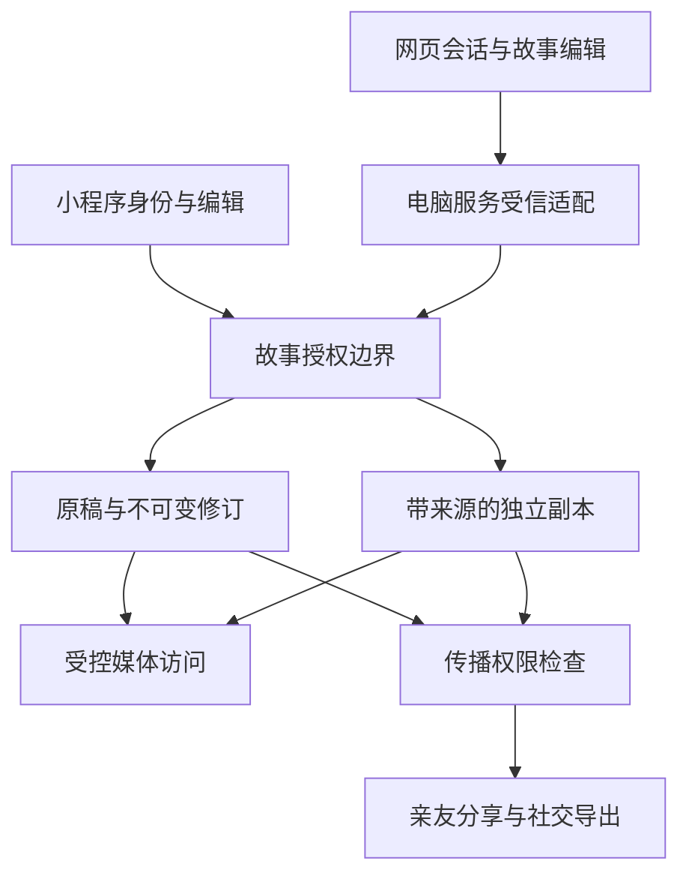

# feat: 故事分享、亲友共创与跨端编辑

## Summary

以小程序现有独立故事及版本库作为共同原稿的权威来源，新增按身份、故事/章节和动作判定的授权边界；副本通过带来源的快照创建，网页通过受信服务访问同一原稿，不再靠重复导入实现“同步”。分阶段完成身份授权、分享副本、共编、网页接续及社交卡片，每阶段具备独立关闭入口和验收门槛。

**文档归属仓库：** shiguang-jiayi-hackathon，现有 `release/2026-09-16-ai-photos` 工作树。
**关联目标仓库：** drinking-time-local（下称“电脑端”；标注电脑端的路径均相对该仓库根目录）。本轮仅只读研究该仓库，未修改业务代码、运行测试、部署或迁移。

---

## Problem Frame

用户需要区分阅读、共同编辑原稿、收入个人故事和再次传播，并能在手机、网页间继续编辑同一本故事。现有代码包含亲友投稿、选段分享、故事版本和电脑快照导入，但这些能力的授权粒度与数据语义不同，不能组合后就宣称满足新的共创与同步需求。

来源及产品规则见 origin：`docs/brainstorms/2026-09-18-story-sharing-collaboration-desktop-requirements.md`。本计划为 Deep：涉及两个仓库、身份、私人内容、持久化和外部平台。

---

## Requirements

以下 R-ID 保持 origin 含义，不重新编号：

- R1–R5：逐人、逐故事/章节授权；阅读、复制、原稿编辑、亲友转发、公开发布分别控制；私密邀请验证身份；撤销原访问不销毁合法副本。
- R6–R9：创建独立副本、保留来源与限制、分离本人新增经历、回传由接收者选择收录。
- R10–R11：保留修改历史及未保存修改；并发不静默覆盖；同版本重复接收幂等，新经历不误去重。
- R12–R13：微信身份进入手机选定故事，网页和手机访问同一逻辑原稿，保存状态、访问权限一致。
- R14：授权摘录的图文卡片预览与导出，不附带私人链接和未选内容。

**Origin actors：** A1 所有者、A2 阅读者、A3 副本创作者、A4 共编者、A5 跨端用户。A3 是自己副本的所有者，但不是原来源传播权的所有者。
**Origin flows：** F1 邀请/共编 → U1、U2、U5；F2 保存/补充/回传 → U3、U4；F3 跨端编辑 → U6、U7；F4 社交卡片 → U8。
**Origin acceptance examples：** AE1–AE11 全部在下方单元测试和最终跨端验证中覆盖。

---

## Scope Boundaries

- 不新增视频发布、自动代发、实时光标、通用社交信息流或付费 AI 链路；声音功能不是前置依赖。
- 不重写整个电脑分镜/影视编辑器，不将家庭文字故事转换为镜头后再反向恢复章节。
- 不合并微信账号与邮箱账号，不迁移或重复发放余额；既有登录及历史快照不删除、不强行转换。
- 不承诺防止截图、手抄或追回外部图片。授权控制覆盖产品内部读写、复制、媒体获取、转发及导出。
- 不在本轮执行真实账号迁移、生产数据写入、付费调用、部署、提审或对外发布。

### Deferred to Follow-Up Work

- 真实账号迁移和平台资质申请：本计划提供兼容设计及核验门槛，获得具体授权后按迁移手册单独执行。
- 已导入电脑的历史快照自动归并：不作为新跨端编辑的默认路径；确有需求时先展示差异再确认归并。

---

## Context & Research

### 已核对的代码事实

- 小程序：原生微信页面、TypeScript 5.9、Node 测试与 tsx；云函数使用 `wx-server-sdk`，部署清单位于 `deploy/wechat-cloud.manifest.json`。
- `cloudfunctions/storyBooks/index.js` 由微信身份构造个人记录空间；`flow.js` 和 `repository.js` 有事务、版本比较、请求指纹去重和独立故事修订。当前读取会加载该空间的故事/修订，不适合直接给章节受邀者复用。
- `miniprogram/domain/storyBookCore.js` 校验章节 ID、记忆归属、全文派生内容及版本。`ManuscriptContent` 当前是文字/照片二选一，尚不能表达本计划需要的持久来源链。
- `cloudfunctions/familyInvite/index.js` 的接受流程把已登录认领者登记为 contributor；`core.js` 按本人投稿或明确分享的记忆过滤可见内容。该流程没有证明首次认领者就是指定亲友，不能直接升级为章节编辑授权。
- `cloudfunctions/photoAccess/core.js` 按可见记忆、用途和审核状态决定照片访问；非所有者不允许 AI 用途。新故事共创不可绕过此限制。
- `miniprogram/pages/book/book.ts` 已有选段生成个人记忆并向指定成员分享的入口，原生分享入口仍是通用首页。新增机制须保留旧数据语义并封住新内容通过旧入口逃逸。
- `miniprogram/services/drinkingTimeAccount.ts` → `cloudfunctions/drinkingTimeBridge/core.js` 传快照、签发一次性登录码。电脑端 `server/services/shiguangStoryImport.ts` 按来源与版本导入，正文转卡片；这是快照而非可逆的双向章节编辑。
- 电脑端使用 Express 4、React 19、tRPC 11、Drizzle/MySQL 与本地持久化分支、Vitest。`server/_core/shiguangDesktopBridge.ts` 具备签名校验与进程内 nonce 表；新跨端写入口不能只依赖进程内去重。
- 电脑端 `docs/features/feature-ledger.json` 记录账号体系为 observing，并要求微信/邮箱账号独立。`client/src/pages/LoginPage.tsx` 及账本显示网页微信能力尚有缺口；未核查实际平台账号资格，不声称已开通。

### Institutional Learnings

- 小程序仓库未找到 `docs/solutions/`。电脑端 `docs/solutions/2026-06-13-故事为唯一单位-镜头按storyId.md` 要求用户明确选择故事且查询校验归属：跨端返回不能兜底打开“最近一本”。
- 电脑端 `docs/solutions/2026-06-13-多worktree环境数据分裂收敛.md` 和 `AGENTS.md` 要求只在主仓库固定服务环境验证，不在工作树启动业务服务或写真实业务数据。规划及测试须避免生产/本地用户数据副作用。
- `docs/wechat-account-migration-runbook.md` 已说明新 AppID/OpenID 变化与稳定业务 ID 原则；本计划补齐实际身份解析，不把更换配置当作用户迁移。

### External References（2026-09-18 已读取）

- 微信网站登录指南：`https://developers.weixin.qq.com/doc/oplatform/Website_App/WeChat_Login/Wechat_Login.html`。需已审核网站应用及登录权限；OAuth 回调含 code/state，回调域需匹配。当前账号是否满足仍待有权限的平台核验。
- UnionID 机制：`https://developers.weixin.qq.com/miniprogram/dev/framework/open-ability/union-id.html`。同一开放平台账号下满足条件的应用可关联用户；不能假定所有账号都有 UnionID，更不能凭昵称合并。
- OWASP Authorization Cheat Sheet：`https://cheatsheetseries.owasp.org/cheatsheets/Authorization_Cheat_Sheet.html`。默认拒绝、每个请求重新鉴权；本计划据此覆盖正文、媒体和导出而非只禁用按钮。

---

## Key Technical Decisions

- **单一原稿权威库：** 延续小程序故事库。网页是带会话的访问端，电脑服务只保留必要身份/故事映射，不产生另一本权威稿；避免两个可写副本互相覆盖和无损转换难题。
- **稳定业务主体：** 引入不依赖 AppID/OpenID 的主体 ID，平台身份作为验证过的别名映射；旧 family/account 标识先保留并映射，不全库重写。旧快照 subject 保留兼容别名，不以新哈希直接创建第二个业务身份。
- **资源与动作授权：** 服务端判定主体、原稿/副本、章节范围、动作和当前授权版本。预设只是界面组合，不构成隐含权限；章节授权不包括改书名、换封面、删书或查看全书历史。
- **原稿与副本不同生命周期：** 授权原稿读取当前版本；保存副本固定当时内容及来源。章节 ID 稳定不按标题猜测；删除章节后旧授权不可转给同位置的新章。受邀者不读取授权前历史，历史展示仅限其可见范围。
- **来源按内容块保守继承：** 给文字/图片块稳定 ID 和服务端来源关系；改写原块仍受其限制。“新增自己的经历”创建独立块，不靠 AI 或文本差异猜作者。混合拼接的块取所有来源权限交集；旧客户端丢掉来源字段必须被拒绝，不能当作自由内容。
- **传播与阅读撤销分离：** 合法副本有独立保留权，不能因复制获得更高传播权利。来源删除仍保留最小权限/来源凭据；后续传播权限变更对已接收副本的生效规则列为上线前产品确认门槛，不隐含回溯撤回权。在确认前，初始传播限制照常执行，但不开放对已发出副本的传播许可变更操作；原稿访问撤销仍按已确认规则执行。
- **可信跨端会话：** 网页浏览器不能携带服务密钥或任意代传 OpenID。电脑服务验证会话后，通过受信服务通道访问小程序权威库；服务调用和用户授权两层都验证。新协议单独版本化，保留现有快照接口。
- **有限冲突处理：** 继续使用故事版本和不可变修订；章节编辑以服务端现稿合成，拒绝越范围全书替换。第一版故事级版本冲突允许保守拒绝，保留草稿后明确提示，不建设 CRDT。

---

## High-Level Technical Design

下图说明方案方向，供评审理解关系，不是要求逐字实现的代码规范。

规划中的新数据职责：主体与平台别名；故事/章节授权及邀请状态；来源许可凭据；带来源的复制/回传操作。具体集合拆分和索引在 U1–U4 定案并同步部署清单；权限、来源、操作记录不允许客户端直写。

---

## Implementation Units

新建路径是建议落点；已有路径为已核对位置。执行中可小幅调整命名，但不能遗漏行为、测试和跨仓库责任。

### U1. 稳定身份与原稿授权内核

**Goal：** 在原稿读写边界建立可迁移主体和细粒度权限，不改变老用户内容归属。
**Requirements：** R1–R5、R10、R13；A1/A2/A4/A5；F1。
**Dependencies：** 无；新功能仅向已完成独立故事迁移的测试主体开放。
**Files：** 新增 `cloudfunctions/storyBooks/identity.js`、`cloudfunctions/storyBooks/access.js`、`deploy/story-sharing/database.rules.json`、`deploy/story-sharing/storage.rules.json`；修改 `cloudfunctions/storyBooks/index.js`、`cloudfunctions/storyBooks/flow.js`、`cloudfunctions/storyBooks/repository.js`、`cloudfunctions/getOpenId/account.js`、`deploy/wechat-cloud.manifest.json`；新增 `tests/story-access.test.js`、`tests/story-identity.test.js`，扩展 `tests/story-books-cloud.test.js`。
**Approach：** 为旧账号幂等建立主体别名与既有空间映射，客户端不能指定自己的主体。所有读写先授权再投影，避免给受邀者调用个人整库 state；事务提交时重查权限及授权版本，所有者身份也不豁免副本来源限制。新集合服务端专用，数据库/存储规则随本单元建立，必须在首次灰度前验证，不能等到 U8 才补；逐章读取只返回已授权章节及所需引用。身份映射不修改余额逻辑，未完成迁移验证的其他旧功能不能被标为已兼容新 AppID。
**Patterns to follow：** storyBooks 的纯内核/仓储适配/事务分层、familyInvite 的可见内容过滤；不直接复制其首次认领即授权模式。
**Execution note：** 对现有所有者读写建立特征测试，再测试优先引入授权矩阵。
**Test scenarios：**
- Covers AE1/AE2：仅第三章授权时猜其他章节、整库 state、历史和封面素材均不可读；编辑不附带复制或传播能力。
- 并发初次登录只产生一个主体；同 OpenID 不同 AppID 不自动认定同一人；已验证迁移别名仍指向原主体。
- Covers AE10：读完后被撤权再提交，事务拒绝写入且不新增修订；客户端伪造 owner/subject 无效。
- 权限服务不可用时拒绝敏感操作；旧所有者自己的普通故事仍满足原访问约束。
**Verification：** 服务入口、仓储与权限矩阵集成覆盖通过，越权请求不会读出正文或留下变更。

### U2. 身份绑定邀请与受限阅读

**Goal：** 让所有者选择人、范围和能力，接收者安全进入授权原稿。
**Requirements：** R1–R5；F1；A1/A2/A4。
**Dependencies：** U1。
**Files：** 新增 `cloudfunctions/storyBooks/invitations.js`、`miniprogram/services/storySharing.ts`、`miniprogram/packages/story-sharing/pages/invite/index.{ts,wxml,wxss,json}`、`miniprogram/packages/story-sharing/pages/read/index.{ts,wxml,wxss,json}`；修改 `miniprogram/pages/book/book.ts`、`miniprogram/app.json`；新增 `tests/story-invitations.test.js`、`tests/story-sharing-pages.test.ts`。
**Approach：** 已识别联系人可绑定稳定主体；未识别接收者先登录申请，所有者确认申请主体后才发放权限，确认前只显示无正文的邀请信息。使用短期随机邀请凭据、摘要存储、限速、一次性认领和可撤销状态。转发创建新邀请而非转交原凭据，下游能力不超过可转授范围，默认阅读；不授予管理他人权限的能力。界面明确“原稿/副本”和四类额外操作。
**Patterns to follow：** `miniprogram/pages/invite/`、`miniprogram/services/familyInviteService.ts` 的身份及失败呈现，但新状态机独立，不把旧 contributor 当作故事编辑者。
**Test scenarios：**
- Covers AE1：陌生人先拿到链接只能申请，无法抢到正文；所有者拒绝后邀请不会变成访问权。
- 同一指定人重复确认幂等，另一个账号认领失败；过期、撤销、并发认领都不误发权限。
- 转发者尝试给下一位增加复制/编辑/公开权限被拒绝；直接重放邀请请求同样受限。
- 原稿更新后受邀阅读者只见授权当前章节；被删章节不回退为全书阅读。
**Verification：** 两个独立测试身份完成邀请与拒绝路径，URL、通知、分享卡标题不泄露未授权正文。

### U3. 来源约束与受控媒体

**Goal：** 原内容的限制经编辑、复制、合并仍可验证，新增经历能单独分享。
**Requirements：** R1、R4、R6–R8、R14；F2/F4；A3。
**Dependencies：** U1。
**Files：** 修改 `miniprogram/domain/biography.ts`、`miniprogram/domain/storyBookCore.js`、`miniprogram/domain/storyBookCore.d.ts`、`scripts/sync-story-core.mjs`、`cloudfunctions/photoAccess/core.js`、`cloudfunctions/photoAccess/index.js`；新增 `cloudfunctions/storyBooks/provenance.js`、`cloudfunctions/storyBooks/media.js`、`tests/story-provenance.test.js`、`tests/story-media-access.test.js`；扩展 `tests/photo-access.test.js`。
**Approach：** 内容块来源由服务端赋值，旧章节/修订按确定性规则补块标识，普通自有内容保持兼容。副本改写继承来源约束，独立新增用显式入口。媒体按来源、章节和用途授权，读图不等于下载导出或送 AI；返回短期受控访问而非永久公开地址。来源关系采用去重 DAG、拒绝环和有界遍历，异常默认拒绝传播。完整保留书稿派生全文与章节一致性校验。
**Patterns to follow：** storyBookCore 的章节校验、photoAccess 的用途区分及审核状态。
**Test scenarios：**
- Covers AE4/AE5：改写、合章、转存、删掉客户端来源字段均不能解除限制；同段含两个来源时取交集。
- 显式新增自己的段落可独立分享，原图和引用文字不被带出；旧客户端提交未知/缺失来源字段时明确升级提示而非覆盖来源。
- 仅章节访问不能取同家庭其他图片；view 授权不能用于 AI/reference/export；URL 过期后需重新鉴权。
- 循环来源、超深链、来源查不到时拒绝传播而不删除已保存副本；旧自有书稿能正常阅读与编辑。
**Verification：** 来源在完整保存/载入/导出链条中不丢失，媒体权限不依赖前端按钮状态。

### U4. 独立副本、回传与去重

**Goal：** 完成接收章节 → 加入个人故事 → 补充 → 回传 → 选择收录。
**Requirements：** R5–R9、R11；F2；A1/A3。
**Dependencies：** U1、U2、U3。
**Files：** 新增 `cloudfunctions/storyBooks/copies.js`、`miniprogram/services/storyCopies.ts`、`miniprogram/packages/story-sharing/pages/receive/index.{ts,wxml,wxss,json}`、`tests/story-copies.test.js`、`tests/story-return.test.js`；修改 `cloudfunctions/storyBooks/flow.js`、`miniprogram/services/storyBooks.ts`、`miniprogram/pages/stories/stories.ts`。
**Approach：** 服务端读取已授权版本建立不可变接收快照，再写目标故事/章节，来源包含原章节、版本、作者和权限上限。复制所需照片/插图形成独立保留引用或复制对象，不能依赖原稿的删除生命周期。存储复制采用可重试操作状态，素材齐备并重查权限后才发布完成副本；失败不出现半章，孤立素材由该操作负责清理。用接收主体+来源版本+动作的持久去重记录处理重试；回传先入待接收项，拒绝不改原稿，新增块有独立版本不被无变化重复判定吞掉。
**Patterns to follow：** story_operations 的指纹幂等、storyBooks 的事务；参考现有媒体任务的持久状态思想但不依赖声音付费任务。
**Test scenarios：**
- Covers AE3：新建故事和追加已有故事两条路径成功，原稿不变；同名目标走既有重名提示不静默覆盖。
- Covers AE6：复制成功后原稿删除，文字和获准复制的素材仍可用且限制保留；复制未完成时原授权撤销不能继续激活副本。
- Covers AE7：同版本并发接受只生成一份；新增经历回传可收录，拒绝不改稿，重复回传不增记忆。
- 跨存储失败、进程中断后重试可恢复；目标版本冲突保持接收待处理，不遗留半份正文或误报成功。
**Verification：** 两身份端到端验证 F2，并模拟照片删除、失败重试、重复提交，正文和素材均无串号/重复/丢失。

### U5. 共同编辑与原入口防绕过

**Goal：** 在授权范围内编辑原稿并保留历史，所有现有出口遵守来源限制。
**Requirements：** R1、R2、R4、R7、R8、R10、R13；F1；A4。
**Dependencies：** U1、U3；可见入口依赖 U2。
**Files：** 修改 `cloudfunctions/storyBooks/flow.js`、`miniprogram/services/manuscript.ts`、`miniprogram/services/storyBooks.ts`、`miniprogram/pages/book/book.ts`、`miniprogram/pages/book/book.wxml`、`cloudfunctions/drinkingTimeBridge/core.js`；按出口核对并接入策略的服务端落点包括 `cloudfunctions/familyInvite/index.js`、`cloudfunctions/generateBiography/index.js`、`cloudfunctions/storyImages/index.js`、`cloudfunctions/storyAudio/index.js`，不得只改客户端；新增 `tests/story-collaboration.test.js`、`tests/story-egress-policy.test.ts`；扩展 `tests/page-handlers.test.ts`、`tests/drinking-time-bridge.test.js`。
**Approach：** 章节写入使用授权范围内的修改，服务端基于当前原稿构建新修订并校验版本，记录实际编辑主体。草稿按身份+故事+章节隔离；无权、断网和冲突保留当前未保存文字但不继续获取原内容。盘点旧选段分享、剪贴板/文本导出、电脑快照、AI 上下文、声音/媒体生成入口，受限内容只能通过各自明确允许的用途；无兼容来源协议的旧出口拒绝处理受限副本，不能降级去掉来源再导出。
**Patterns to follow：** `saveStoryRevision`、故事版号/修订校验、已有内容安全检查；不为了共编开放所有云端家庭数据。
**Test scenarios：**
- Covers AE2/AE8：编辑者只改第三章且留痕；同时两人保存同版本只有一人成功，另一人的草稿保留。
- Covers AE10：撤权后保存被拒绝，切换账号后不露出上一账号草稿；冲突重试仍需用户确认而非覆盖。
- 用篡改的全书请求、恢复旧版本或移动章节尝试越权被拒绝；历史投影不能泄露其他章节。
- Covers AE4/AE5：旧选段分享、快照传电脑或生成媒体都不能去掉来源限制；普通自有内容旧流程不回归。
**Verification：** 逐章写入、历史、旧出口及失败状态联合覆盖；现有书架/迁移/照片/音频相关回归通过。

### U6. 跨端身份与可信访问协议

**Goal：** 建立从网页登录主体到小程序稳定主体及指定故事的可信关联。
**Requirements：** R3、R5、R12、R13；F3；A5。
**Dependencies：** U1；官方网页 OAuth 的真实开放须通过平台资格门槛。
**Files（小程序）：** 新增 `cloudfunctions/storyDesktopAccess/index.js`、`cloudfunctions/storyDesktopAccess/core.js`、`cloudfunctions/storyDesktopAccess/package.json`、`cloudfunctions/storyDesktopAccess/config.json`、`tests/story-desktop-access.test.js`；修改 `miniprogram/services/drinkingTimeAccount.ts`、`docs/integrations/drinking-time-bridge-contract.md`、`deploy/wechat-cloud.manifest.json`。
**Files（电脑端）：** 新增 `server/services/shiguangStoryAccess.ts`、`server/_core/shiguangStoryAccessRoutes.ts`、`server/_core/shiguangStoryAccess.test.ts`、`server/services/shiguangStoryAccess.test.ts`；修改 `server/services/accountIdentity.ts`、`server/_core/index.ts`、`docs/integrations/shiguang-bridge-contract.md`、`docs/features/feature-ledger.json`。官方 OAuth 若现有模块不能复用，建议新增 `server/services/wechatWebsiteLogin.ts`、`server/services/wechatWebsiteLogin.test.ts` 及 `server/_core/wechatWebsiteLoginRoutes.ts`、`server/_core/wechatWebsiteLoginRoutes.test.ts`；禁止改写邮箱/Google 登录。
**Approach：** 先核查网站应用审核、授权域名及平台绑定，仅记录非秘密核验结论。官方 OAuth 使用服务端 code 交换、一次性 state 与发起浏览器会话绑定、安全 Cookie 和回调白名单。无法直接关联时使用现有微信已登录用户的双证明关联流程；无 UnionID 不猜匹配，也不合并邮箱身份。旧短码继续保持原语义，不冒充官方扫码。新故事访问协议从已验证网页会话解析主体，限制服务调用 audience、动作及目标；签名凭据仅服务端持有，持久重放防护、短期时效、限速、超时与错误脱敏。权限仍由权威库逐请求判断。
**Patterns to follow：** 两仓桥接契约版本规则、现有 accountIdentity 持久化边界、签名校验/响应校验；改进进程内 nonce 仅单实例有效的限制。
**Test scenarios：**
- Covers AE9：登录返回手机指定故事，不选择最近故事；错误 userId、伪造 subject、其他故事目标被拒绝。
- state 丢失/重复、过期 code、开放重定向、CSRF、错误签名、双实例重放均失败；服务密钥和用户内容不进浏览器或日志。
- 新 AppID 尚未绑定时拒绝接旧主体；双证明后仍访问原主体故事，不重复注册或赠送余额。
- Covers AE10：已登录网页撤权后下一次读写仍被拒绝；权威服务不可用不回落到电脑快照充当现稿。
**Verification：** 两仓契约测试一致；真实 OAuth/真实账号绑定单独验收，未验收不得声明跨端登录完成。

### U7. 网页故事编辑适配

**Goal：** 网页保留章节、文字、照片及来源，直接编辑同一原稿。
**Requirements：** R1、R7、R8、R10、R12、R13；F3；A5。
**Dependencies：** U3、U5、U6。
**Files（电脑端）：** 新增 `client/src/features/shiguang/StoryEditorPage.tsx`、`client/src/features/shiguang/storyDocument.ts`、`client/src/features/shiguang/StoryEditorPage.test.tsx`、`client/src/features/shiguang/storyDocument.test.ts`、`server/integration/shiguangStoryAccess.test.ts`；修改 `client/src/pages/LoginPage.tsx`、`client/src/app/router/AppRouter.tsx`、`docs/features/feature-ledger.json`；保留 `server/services/shiguangStoryImport.ts` 原快照语义。
**Approach：** 在电脑端提供原生章节文档适配入口，不经过分镜卡片模型。所有加载/保存带明确故事与基础版本；限制请求可修改字段，来源等不可由客户端重写。只返回授权照片的短期访问地址。未保存离开提示、请求取消与故事切换隔离，旧请求不得刷新到新故事；冲突展示本地稿和可见现稿供选择，保存重试使用稳定请求 ID。章节排版与素材显示可复用现有组件，不能丢未知来源字段后回写。
**Patterns to follow：** 电脑端显式 activeStoryId、现有身份会话与路由、组件测试方式；小程序版本与来源协议作为共同契约。
**Test scenarios：**
- Covers AE8/AE9：手机改后网页刷新、网页改后手机刷新均正确；并发冲突不覆盖；错误账号不能看题名/缩略图。
- 章节顺序、中文换行、图片、独立新增块及来源往返保持；加载未知协议版本时只读提示而不有损保存。
- 快速切换故事、退出登录、旧请求迟到不串稿；会话过期保留本地未保存文本但重新登录后核对身份再恢复。
- 断网/超时/重复点击保存明确失败或恢复，不出现重复修订；网页权限与小程序完全一致。
**Verification：** 真实手机与网页完成 F3，章节与素材往返无损；不以模拟会话或 UI 截图代替后端同步验收。

### U8. 社交卡片与分阶段交付验收

**Goal：** 授权内容导出可发布图文卡片，完成整体安全及回滚验证。
**Requirements：** R4、R7、R8、R14，最终覆盖 R1–R14；F4。
**Dependencies：** U2–U5；网页入口及全流程验收另依赖 U7。
**Files：** 新增 `cloudfunctions/storyBooks/exports.js`、`miniprogram/services/storyShareCard.ts`、`miniprogram/packages/story-sharing/pages/card/index.{ts,wxml,wxss,json}`、`tests/story-share-card.test.ts`、`tests/story-sharing-e2e.test.ts`、`docs/story-sharing-rollout.md`；更新并验收 U1 建立的 `deploy/story-sharing/database.rules.json`、`deploy/story-sharing/storage.rules.json`，修改 `deploy/wechat-cloud.manifest.json`、`docs/wechat-account-migration-runbook.md`。电脑端新增 `client/src/features/shiguang/StoryShareCard.tsx`、`client/src/features/shiguang/StoryShareCard.test.tsx`。
**Approach：** 服务端先为所选版本、摘录及素材生成有界的授权导出描述，终端只渲染该描述；最终获取导出材料时重查权限，预览过不构成长期权限。使用确定性排版，不调用 AI。分享消息只含安全标题及受控入口，不带原稿全文或私密凭据；产品保存相册失败不宣称已发布。收集权限拒绝、保存冲突、复制失败和桥接失败的脱敏指标。
**Patterns to follow：** 既有内容审核与照片用途检查，现有部署 manifest 和账号迁移清单；格式检查不等于真机验收。
**Test scenarios：**
- Covers AE5/AE11：亲友可转发但不可公开时拒绝导出；自有授权卡片预览/导出一致，无未选章节、私人链接、临时授权 URL 或隐藏素材。
- 长中文、emoji、超长题名、多图片和空摘录的可读布局/明确边界；相册拒绝授权、图片失效、生成中撤权都有清楚结果。
- Covers AE4/AE6：混合来源及已删除原稿的副本仍按来源限制判定，不能通过整本导出绕过。
- 完成 AE1–AE11 的服务端/双端矩阵，验证灰度关闭新入口后仍可读老故事，不恢复旧客户端越权写能力。
**Verification：** 图文真机视觉检查、两账号隐私检查、规则部署核验和全回归留证；未获得发布授权不提审、不发社交平台。

---

## Phased Delivery

1. 身份与安全基础：U1；同时核实 U6 官方登录资格。先让测试主体跑通权限矩阵，不开放外部分享。
2. 亲友共创闭环：U2、U3 → U4、U5。用两个测试身份验证阅读、副本和撤权，不要求先完成网页。
3. 网页接续：U6 → U7。契约与主体映射先行，不能用导入快照替代验收。
4. 社交导出与整体发布准备：U8。社交卡片可在小程序闭环通过后开发；整体发布须双端与规则验证完成。

每个阶段按新能力开关灰度；U-ID 表达计划单元，不代表已完成进度。任一涉及未知产品规则的环节先保持关闭，不阻塞无关单元的本地开发。

---

## System-Wide Impact

- **鉴权入口：** 小程序云函数、网页会话/代理、素材和导出必须一致；不能把可见章节缓存为全书或在账号切换后复用。
- **错误传播：** 区分无权限、内容不存在、需升级协议、冲突、下游不可用。对无权者不区分资源确实存在与否；对合法编辑者保留未保存稿并给可操作提示。
- **事务边界：** 内容写入、版本推进、编辑归属和幂等记录在同一数据库事务；素材复制在事务外有持久阶段，激活副本前验证完备性及当前权限。
- **权限撤销：** 提交时重查。服务端缓存按主体/范围/授权版本隔离；已经发送到设备或短期 URL 的字节不可收回，禁止宣称绝对即时抹除。
- **删除与保留：** 原稿删除不触发副本所需资产删除；媒体回收按保留引用，失败任务只清理自己创建的临时对象。来源凭据保留最小信息，不能让已撤权用户凭来源跳回全文。
- **兼容：** 老用户个人故事读取与版本历史、照片审核、AI 同意、独立故事迁移都保留；旧客户端不能在新来源文档上执行有损写入。旧快照照常可查看但不标为同步稿。
- **性能：** 章节受邀读取不可加载整家庭全部故事后再前端过滤。邀请、授权、来源、去重按主体/资源索引，历史分页；来源链遍历与导出大小有界，具体上限在实现前结合现有限制确定并向用户提示。

---

## Open Questions

### Resolved During Planning

- 原有电脑接口能否直接复用实现双向编辑？不能：快照按版本导入且转为卡片。保留旧接口，增加共同原稿访问协议及章节适配。
- 能否用昵称或相同 OpenID 跨应用关联？不能：主体/平台别名分离，仅用可靠平台证明或双端验证建立关联。
- 能否复用 contributor 作为共编角色？不能：权限粒度与认领语义不同，新增故事授权，不扩大旧亲友权限。
- 如何让“自己的新增经历”独立分享？使用明确新增内容块及服务端来源标记，不把修改字数或 AI 判断作为解除限制依据。
- 原稿阅读与副本保存的版本如何区分？原稿是授权范围内当前版本，副本保存确定版本，不静默追随原稿更新。

### 实施/开放前门槛

- **平台核验（阻止官方 OAuth 开放，不阻止 U1–U5）：** 网站应用审核、登录能力、回调域名、平台绑定及新旧账号迁移资格尚未在当前账号验证；缺资格时先向用户说明可行替代，不静默改为短码即完成。
- **产品确认（阻止相关传播权限变更上线）：** 原所有者后来降低传播权限，是否影响已经合法保存且曾获传播许可的副本？origin 只明确访问撤销不删副本及原限制不因改写消失，未明确这种追溯变化。实施不得擅自确定可撤回已授许可。
- **契约一致性（阻止 U7 开放）：** 电脑端权威契约与小程序副本同步升版，双方需验证不可伪造的主体传递、版本冲突、照片访问和来源保存。当前实例部署、数据规则与运行状态本轮未探测。
- **运行时证据（留给执行）：** 真机包体/分包加载、存储 URL TTL、微信内容审核、云函数跨服务调用配置及恢复测试均需真实环境证据，不能在规划阶段声称通过。
- **具体落库/索引和复制容量：** U1–U4 实现前检查实际集合/事务/素材限额；超过限额必须显式失败或持久分批处理，不降低授权保证。

---

## Risks & Dependencies

| 风险 | 处理与发布门槛 |
|---|---|
| 来源限制被旧导出/生成入口绕过 | U5 盘点所有出口，受限内容缺少兼容协议即拒绝，不先上线后补 |
| 授权后新版本扩大可见范围 | 授权绑定稳定章节 ID；读取与历史过滤；新增章节不得自动进入章节级授权 |
| 原稿删除让合法副本照片失效 | U4 建立独立保留引用/素材，删除与复制并发验收 |
| 新 AppID 导致多身份或重复赠送 | U1/U6 可靠别名映射，保留旧 subject；迁移验收不凭“只有一个用户”自动认领 |
| 网页改写损失图片、来源或章节 | U7 专用章节协议，未知版本拒绝写入；不借分镜快照反向恢复 |
| 云端/电脑数据出现双主 | 原稿只在权威库提交；电脑缓存不可成为权威故障时的可写降级 |
| 平台资格不具备 | 提前核验，其他阶段可开发；官方登录入口保持未开放且不虚报完成 |

---

## Documentation / Operational Notes

- 发布前更新新集合、索引、函数、数据库/存储规则和环境变量名称清单，不记录密钥或用户正文。规则验证要证明客户端不能直接绕过函数读写新私密集合。
- 电脑端按 `AGENTS.md` 更新功能生命账本；本地验证不得在 worktree 启业务服务或触碰用户真实持久化文件。禁止借本计划自动合并分支、清理旧工作树。
- 顺序为服务端协议/规则 → 兼容客户端 → 测试主体灰度 → 两账号真机/网页验收 → 经用户授权部署。客户端不能因函数缺失而退回无授权的本地分享路径。
- 回滚关闭新分享/共编/网页写入入口并保留新修订及副本；已引入来源的故事不可退回会丢来源的旧写接口。修复兼容后再恢复，不删除数据“回滚”。
- 成功条件：F1–F4、AE1–AE11 留有实际验证证据；原有回归通过；错误、冲突、越权有明确结果。完成文档/页面/mock 测试不等于已上线。

---

## Sources & References

- Origin：`docs/brainstorms/2026-09-18-story-sharing-collaboration-desktop-requirements.md`。
- 既有计划：`docs/plans/2026-09-17-001-feat-independent-story-books-plan.md`；不修改其进度或完成状态。
- 桥接与迁移：`docs/integrations/drinking-time-bridge-contract.md`、`docs/wechat-account-migration-runbook.md`。
- 电脑端：`AGENTS.md`、`docs/features/feature-ledger.json`、`docs/integrations/shiguang-bridge-contract.md` 及 Context & Research 中列出的源码/经验文件。
- 外部官方及安全参考见 Context & Research，均为只读研究；未访问或修改后台账号设置。
