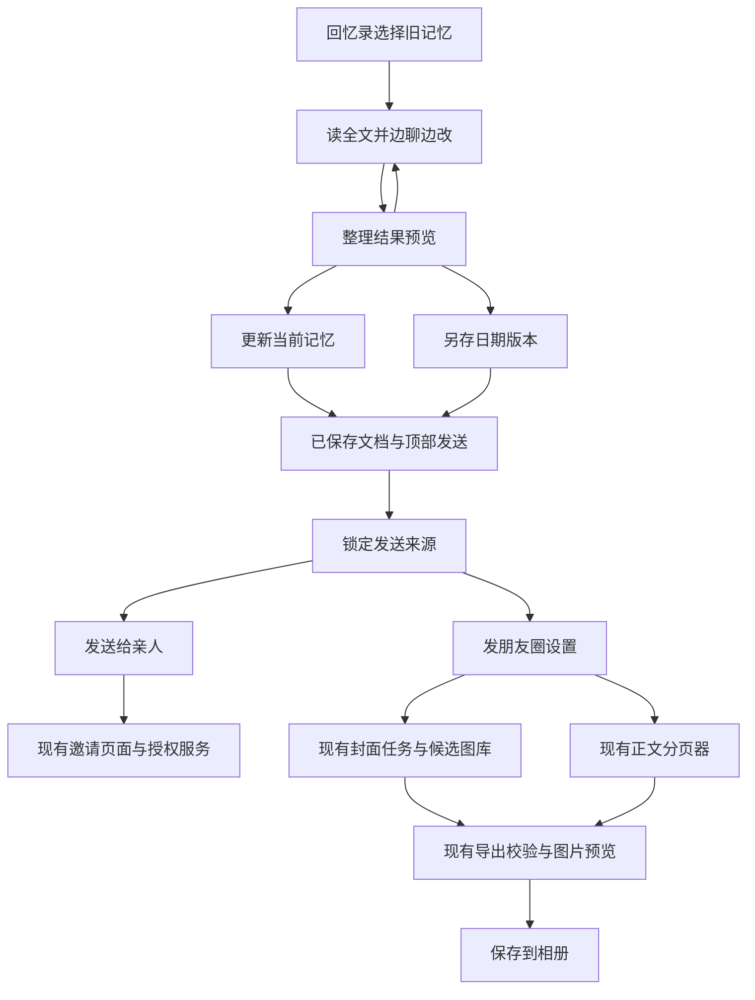

# 旧记忆阅读、AI 共创编辑、版本保存与发送

## 目标与范围

完整主线是：**打开旧记忆 → 边看边聊边改 → 预览 → 选择如何保存**。用户从首页回忆录找到旧记忆，先阅读完整正文；同一页面上方是可编辑文档，下方是可展开 AI 对话。点击「整理成片段」后在当前体验中预览，明确选择「更新当前记忆」或「另存为新版本（日期）」。这是本次必须实施的范围，不能只作为发送功能的背景。

发送与图片生成接在上述主线后：页面顶部保留「发送」，选择「发送给亲人」或「发朋友圈」。朋友圈流程允许选择封面数量和正文图片数量，再生成、预览、保存相册。复用已有编辑/整理、发送、邀请、图片任务、分页和相册能力；原模块缺口与原负责人协作补齐，不另建重复系统。

用户已授权开始实施，并指出上一稿遗漏编辑主线。本稿以该纠正为准，由同一个接入任务统一负责，避免编辑、保存与发送使用不同来源。当前尚未完成代码接通。产品主文档见 `docs/handoff/2026-09-25-memory-coediting-full-experience.md`，启动协作约定见 `docs/handoff/2026-09-25-send-image-integration-start.md`。

研究基线为 main `f39abb4`。发送负责人另在 `fix/cover-image-time-budget` 工作树核对并报告 158 项定向测试通过；这不等于本方案新增流程已经通过真实验收。其工作树的未提交修改不能直接视为 main 的能力。

---

## 已有能力与缺口

| 环节 | 已有实现 | 本次需要补齐 |
|---|---|---|
| 阅读旧记忆 | archive 可按记忆 id 打开；采访与整理能力分布在既有页面/服务 | 核实并接通先阅读全文、上文档下聊天的同页体验 |
| 共创与预览 | 已有 memoryOrganizerService 和记忆修订结构；具体完整流程待核验 | 手改与聊天协作、整理结果预览、过期结果不覆盖新手改 |
| 两种保存 | 已有记忆保存/修订相关能力；不能假定已满足两种保存语义 | 明确更新当前与另存日期版本，保存后重开可核对 |
| 发送入口 | 书稿目录顶部的发送菜单 | 记忆阅读/编辑页面入口及已保存来源传递 |
| 发给亲人 | 按故事与章节授权的邀请；另有加入记忆之家的邀请海报 | 明确入口语义；单记忆不可暗中扩大为整书或家庭权限 |
| 发朋友圈 | 全书、章节、选文；本地图片预览和相册保存 | 记忆来源接入、数量选择与多封面消费 |
| AI 封面 | 每次生成一张，可使用参考图和用户想法，已有任务与候选图库 | 连续生成所需数量、仅用于本次分享的候选选择 |
| 正文图片 | 现有 Canvas 渲染，自动分页或长图，字号选择 | 在现有分页器上支持目标张数及可行性提示 |
| 版本校验 | 锁定当前保存的书稿 revision/version | 单记忆与选定历史版本的服务端来源解析 |

邀请和导出仍受环境能力开关控制。发送负责人观察到故事邀请页显示「亲友邀请尚未开放」；本轮未重新核验所有线上开关，也未开启。代码存在、云函数部署和用户可用必须分别验证。

---

## 用户操作路径

1. 首页「回忆录」→ 选择旧记忆 → 展示已保存正文与所选版本；不自动开始新采访或 AI 生成。
2. 上方读/改文档，下方展开与 AI 聊天；AI 对话围绕当前记忆和新增补充，用户可随时回到正文继续修改。
3. 点击「整理成片段」→ 当前页面内预览整理后的文档，可返回继续聊/改；生成或打开预览均不自动保存或覆盖原记忆。
4. 预览确认后明确选择「更新当前记忆」或「另存为新版本（日期）」。前者更新当前记录并沿用已有历史保护；后者保留原版本，产生可区分的新版本。成功后打开实际保存结果；失败保留草稿，不展示假成功。
5. 在阅读或编辑页面顶部点击「发送」。无修改时可发送当前已保存版本；有修改时回到同一预览和两种保存选择，成功后继续发送，不能用“保存并发送”偷偷替用户决定覆盖方式。
6. 选择「发送给亲人」或「发朋友圈」；朋友圈选择已有/新生成封面及封面、正文图片张数。
7. 生成图片并预览，保存相册，由用户发布朋友圈。图片预览与第 3 步的文档预览必须在文案上区分。

正文图片是排版现有文字，不需要再次调用 AI 绘图。不能为了满足指定张数删字，也不能暗中缩到不可读；放不下时提示可行张数，让用户更改选择。过多张数导致空白页时同样提示调整。

以下为接入关系示意，具体实现沿用现有服务边界：

---

## 需求与待确认项

- R1：在当前记忆页面完成目的地选择，发送内容明确绑定用户正在看的已保存版本。
- R2：亲人邀请沿用现有邀请流程，不扩大授权范围。
- R3：用户可决定封面与正文图片数量；实际生成、预览和保存结果与确认的数量一致，无法满足时明确反馈。
- R4：复用现有图片任务、同意授权、额度检查、内容审核、分页、导出校验和失败重试。
- R5：取消、返回、切换账号、版本变化、部分生成/保存失败时，不泄露内容、不重复付费、不丢草稿。
- R6：原任务各自维护原模块；接入任务统一负责阅读/共创/保存主线、页面协调和来源衔接，复用已有能力，不复制实现。
- R7：打开旧记忆先显示完整已保存正文；上方文档、下方可展开聊天，用户可以边看边聊边改，不跳入新采访作为默认结果。
- R8：「整理成片段」在当前编辑体验内产生可检查的预览；返回继续修改不丢输入，未确认不能写入原记忆。
- R9：保存明确提供更新当前和另存日期版本；新版本保留原版且可区分，同日多次另存不得互相覆盖。
- R10：编辑、AI 整理、预览、版本保存与发送绑定同一来源；晚到的 AI 结果、并发修改、重复点击保存及失败重试不能覆盖新手改或创建重复版本。

**等待用户选择：**「发送给亲人」是阅读选中的记忆，还是加入记忆之家的邀请海报？已发出问题。下文邀请接入按前者描述为候选方案；若选择后者，只跳现有家庭邀请页，并清楚说明不会发送记忆正文。未收到选择前不修改邀请范围。

**建议，尚未确认：**朋友圈所选封面仅影响本次分享，默认不更换书封面。生成数量与导出数量分别表达，使用已有图不应触发付费生成；用户明确确认新增生成数后才提交。具体数量上限由图片负责人结合既有额度与渲染限制给出，不在界面随意承诺无限张数。

---

## 实现单元与归属

### U5：旧记忆同页阅读、对话与编辑

**负责：**新接入任务先与现有页面负责人核对已有改动，约定文件后实施；不新建重复编辑器。**需求：**R5、R6、R7、R8、R10。**依赖：**核实记忆读取与编辑状态；可与 U1 的云端来源核实相互推进。

**文件：**`miniprogram/pages/archive/archive.{ts,wxml,wxss}`、`miniprogram/pages/interview/interview.ts`（先作为已有对话/整理复用参考，非默认整体改写）、`miniprogram/services/memoryOrganizerService.ts`。复用 `tests/memory-organizer-service.test.ts`；按项目测试结构新增 `tests/memory-coediting.test.ts`。

**方法：**从回忆录点击记忆时进入正文阅读状态。将当前已保存版本、用户编辑草稿、聊天消息、AI 整理候选分开管理，保证同页切换时文字和输入不丢。AI 回复先进入聊天或整理候选，不能直接覆盖编辑正文。整理调用绑定发起时的草稿/来源；返回时如正文已继续修改，标明结果基于先前内容，不无提示覆盖新手改。展开聊天和键盘不应遮住输入与预览操作。

**测试场景：**旧记忆点击先读全文；展开聊天后继续手改；整理中继续编辑；AI 超时保留正文和输入；取消预览回编辑；切换记忆或账号时旧任务晚回不污染新页面；长文阅读与键盘操作可用。

**完成依据：**用户不离开当前记忆的编辑体验即可读、聊、改和预览；取消或失败不改变已保存内容。

### U6：文档预览与两种保存

**负责：**新接入任务与保存/数据模块负责人约定边界后实施。**需求：**R1、R5、R8、R9、R10。**依赖：**U5 编辑状态与 U1 权威保存/来源合同相互对齐，先确定合同再接最终按钮。

**文件：**`miniprogram/pages/archive/archive.{ts,wxml,wxss}`、`miniprogram/domain/biography.ts`、U1 核实后的实际云端保存入口（须在实施时补具体文件）。复用 `tests/memory-segments.test.ts`，新增 `tests/memory-save-versions.test.ts` 及 `tests/memory-coediting.test.ts` 中保存流程场景。

**方法：**预览显示实际待保存标题/正文，并允许返回修改。两个保存动作使用明确标签，不把关闭预览当确认。更新当前保持当前记忆身份并按既有机制记录历史；另存版本保留原内容，通过现有模型表达版本关联，显示本地日期，同日重复用时间或序号区分，内部唯一标识不依赖日期字符串。保存确认来自真实持久化结果，返回明确的记忆与权威版本供重新阅读和发送。已有入书章节不因编辑记忆被静默改写，入书仍沿用显式流程。

本地 `aiRevisions.id` 只能作为已存在数据的线索，不能单独充当云端权威凭据；用户可见的日期版本、内容历史与云端并发/来源标识需要明确映射，不要因为“版本”同名就直接复用为同一语义。

**测试场景：**预览取消后原文不变；更新当前后重开显示新文且不新增无关记忆；另存后原版保留、新版可找到；同日另存两次都可区分；双击/超时重试不重复创建；并发变更不静默覆盖；保存失败草稿仍在；保存成功再发送读取精确的新版本；发送前存在草稿时仍提供两种保存选择。

**完成依据：**两条保存分支分别从真实旧记忆走完并重新打开核对；未保存草稿或仅本地成功不能被当作可发送版本。

实施顺序以 U5/U6 的完整编辑主线和 U1 来源合同为先；U2/U3 可继续独立模块工作，U4 最后验收整体。保留原 U1–U4 编号，新增 U5/U6 避免破坏其他任务已有引用。

### U1：接通当前记忆与发送入口

**负责：**本接入任务协调页面负责人；与发送负责人共同约定来源适配归属。**需求：**R1、R2、R5、R6、R10。**依赖：**与 U5/U6 对齐编辑/保存合同；邀请语义选择仅阻塞邀请分支；数据来源合同先于 U2/U3 的记忆接入。

**文件：**`miniprogram/pages/archive/archive.ts`、`miniprogram/pages/archive/archive.wxml`、`miniprogram/services/bookSend.ts`、`miniprogram/domain/biography.ts`；服务端权威来源入口由发送负责人核实后补入文件清单。测试复用 `tests/book-send.test.ts`、`tests/memory-segments.test.ts`，新增页面接入测试 `tests/memory-send.test.ts`。

**方法：**当前记忆入口是 archive 的 `id`/`editingId`，不是凭空新增第二个编辑器。核实云端可读的保存记录，再定义最小来源适配；已知本地 `MemoryAiRevision.id` 不能直接当作云端权威修订。客户端仅传已验证的来源标识与选择，云端读真实内容并检查账号、所有权、删除状态、版本及发布权限；不能把临时 editText 当权威正文。

书稿继续沿用 storyId/revisionId/version。记忆需要 memoryId 和被选中的已保存修订身份；没有云端稳定修订记录时，先补足保存/同步契约再发送，不能仅放宽客户端检查。

`memoryPlacements()` 可能返回零个、一个或多个章节，而且入书文字可能已经改写。因此不得静默把记忆替换成章节文字，不伪造 storyId，也不强制先入书。若用户主动选择发送「所在章节」，可复用现有章节选择；直接发送记忆仍必须补齐来源适配。历史书稿导出目前只允许 currentRevision，不承诺已经支持历史记忆发送。

**测试场景：**未入书记忆；多个 placement；入书文字与记忆不同；旧记录没有显式修订；保存失败；选中历史修订；另一个账号/已删除来源；保存后页面被其他任务修改。预期是准确发送选定来源或明确阻止，不偷换内容。

**完成依据：**云端可独立还原选定内容，入口预览与原文一致。亲人阅读单记忆如需扩展邀请目标，由发送负责人在现有权限模型内提出最小方案；仅有客户端跳转不算完成。

### U2：图片任务补齐多封面衔接

**负责：**「拾光 AI 图片生成：新想法与流程改造」。**需求：**R3、R4、R5、R6。**依赖：**U1 来源合同；单次生成逻辑可先核对。

**文件：**`miniprogram/services/storyCoverService.ts`、`miniprogram/pages/story-cover/story-cover.ts` 及相应 WXML、`cloudfunctions/storyImages/index.js`、`cloudfunctions/storyImages/core.js`、`cloudfunctions/storyImages/cover.js`、`cloudfunctions/storyImages/flow.js`。测试复用 `tests/story-cover.test.js`、`tests/story-images.test.js`、`tests/story-images-page.test.ts`。

**方法：**沿用单张任务和候选库，按现有并发/额度限制顺序生成用户确认的新增数量。每张请求有稳定 requestId；请求超时先查询原任务，不能重新下单。回传任务状态和受控 imageId，发送侧负责最终预览与导出校验。若用于单记忆，生成提示词与授权说明必须绑定同一记忆修订，不能仍发送整书正文。

图片负责人已确认可用薄包装提供候选列表、单张提交和原任务查询；首版不新增批量付费 API 或另一套任务状态机。发送/协调层记录每张任务与数量，图片层继续维护单张任务生命周期；明确生成候选数和最终导出封面数，不以候选生成完成冒充用户选定数量已经导出。现有任务已有 sourceRevisionId/textHash，应优先复用而不是重复建立版本字段。

分享选择与「设为书封面」分开处理；不自动调用现有 select 改书版本。批次支持查看已完成部分和取消尚未提交部分，失败说明具体缺少几张；不得悄悄以少量图片冒充完整结果。

生成任务也必须记录输入来源与修订身份；提交前来源变更时先让用户重新确认，完成后的旧结果不能自动附到新版本。既有图库复用仍须按现有规则检查使用权限。取消或关闭页面不会承诺撤销已提交的付费任务；再次进入先恢复原任务状态，失败重试明确展示剩余数量与是否新增调用。

**测试场景：**选择已有两张不新增请求；三张任务第二张失败；超时恢复；重复点击；离页后回执；额度不足；来源更新或账号切换；只选分享封面时书封面保持原值。新增付费调用须遵循届时有效的用户授权。

**完成依据：**向发送模块提供可校验的多张候选，保持现有单封面入口兼容。负责人已确认复用边界，但扩展尚未实现，不宣称已支持批量生成。

### U3：发送任务接入数量、邀请与导出

**负责：**「拾光发送功能：家人邀请与社交图文」。**需求：**R2–R6。**依赖：**U1、U2；正文分页适配可先独立核实。

**文件：**`miniprogram/packages/story-sharing/pages/social/index.ts` 及其 WXML、`miniprogram/packages/story-sharing/pages/invite/index.ts`、`miniprogram/services/bookExport.ts`、`miniprogram/services/bookImageLayout.ts`、`miniprogram/services/bookImageRenderer.ts`、`cloudfunctions/storyBooks/bookExports.js`、`cloudfunctions/storyBooks/invitations.js`。测试复用 `tests/book-export.test.js`、`tests/book-image-layout.test.ts`、`tests/book-image-renderer.test.ts`、`tests/story-sharing-pages.test.ts`、`tests/story-sharing-e2e.test.ts`。

**方法：**现有 social 页承接设置和预览；在现有分页器上增加目标张数与可行范围，遵守可读字号和画布尺寸限制。预览与正式渲染使用同一算法和配置，不新增 AI 正文图片生成器。

导出 descriptor 必须覆盖同一内容修订、全部封面 imageId/有效文件身份、选择顺序和相关排版配置；每张封面均经服务端检查归属、状态与发布权限，禁止任意 URL 直通。默认旧调用仍为一张封面和自动分页，保持兼容。

从 social 跳封面再返回，需要核实选择是否丢失。仅在同账号、同来源且版本重验通过后恢复章节/选文；已有 onHide 隐私清理不可直接删掉。版本或权限变化先失效再要求重新选择，不能靠旧缓存继续导出。

若用户选择阅读记忆，邀请绑定明确内容范围，沿用申请、核验、同意和撤销机制。未入书记忆的邀请目标适配未落实前，不能替换成整书邀请；家庭加入海报也不能伪装成阅读分享。

**测试场景：**可容纳三张与无法容纳一张正文；段落换行/特殊字符无遗漏；非本人或已删除封面；多图中一张不合规；来源更新；封面返回保留合法选择；账号切换彻底清除；相册部分失败续存；邀请撤销后不可阅读。

**完成依据：**全部所选图片被一致校验，预览和保存数量/顺序一致；授权范围与发送对象一致。

### U4：联调与交付

**负责：**本接入任务汇总，两位原负责人修复各自模块。**需求：**R1–R10。**依赖：**U1–U3、U5、U6。

**文件：**扩展 `tests/story-sharing-e2e.test.ts`，记录 `docs/handoff/2026-09-25-send-image-integration.md`（实施验收时创建）。

**方法与场景：**在统一代码版本与微信开发者工具上，从首页回忆录打开真实旧记忆，阅读、连续对话、手改、整理预览，分别走更新当前和另存日期版本，重新打开核对，再走发送、已有/新生成封面、正文数量、图片预览、相册保存、返回继续编辑。覆盖取消预览、AI 晚回、保存失败、独立记忆和入书记忆，至少一次部分生成失败恢复。邀请采用专用测试内容与账号，验证接收和撤销；不向真实亲人随意发测试消息。只完成发送与图片链路不能作为整体完工。

记录客户端版本、已部署云函数、能力开关、服务商能力四层状态。功能关闭时显示原因，不静默跳到别的邀请类型。真机核验相册权限、长图内存和微信发布路径；本地测试通过不能代替真机结论。

**完成依据：**相关自动化检查通过，真实流程验收完成，清理本轮测试增量，并明确任何真机限制。依仓库 AGENTS.md，完成完整流程后才提供新的验证二维码。本轮不生成二维码、不改线上开关、不发布。

---

## 已发出的协调要求

- 两个原任务都已收到能力核对和最小衔接要求；发送任务已回报具体接口、来源缺口及定向测试结果，并表示首轮未发现无需产品决定的现有缺陷。
- 发送任务已收到更具体的封面返回选择恢复检查，以及多封面 descriptor、正文数量和单记忆来源合同要求。
- 图片任务已提交 `docs/handoff/2026-09-25-image-send-contract.md`（当前在其界面验收工作树，尚不假定已合入 main），确认现有接口只接 storyId、单次一张，建议以候选列表/单张提交/状态查询薄包装接入。已将其能力边界和文件归属补入 U2；新增衔接尚未实施。

## 参考

- `docs/handoff/2026-09-24-book-send-implementation.md`
- `docs/handoff/2026-09-24-book-send-sharing.md`
- `docs/design/2026-09-24-book-send-design.md`
- `docs/solutions/integration-issues/wechat-media-cross-layer-debugging-2026-09-19.md`
- `AGENTS.md`
